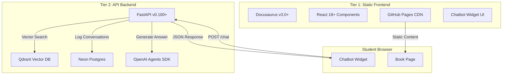

# ADR-001: Two-Tier Architecture (Static Frontend + API Backend)

- **Status:** Accepted
- **Date:** 2026-02-09
- **Feature:** Book Publication & RAG Chatbot
- **Context:** Physical AI curriculum requires both static educational content delivery and dynamic AI-powered assistance

## Context

The Physical AI & Humanoid Robotics Platform needs to deliver educational content to students while providing an intelligent RAG chatbot assistant. The system must:

1. **Publish curriculum content** as an accessible, searchable book with fast page loads (<2s)
2. **Enable RAG chatbot** with vector search, LLM integration, and conversation logging
3. **Support 20 concurrent students** without performance degradation
4. **Stay within free tier limits** (GitHub Pages, Qdrant 1GB, Neon 500MB, Railway 500 hours/month)
5. **Deploy independently** - book updates shouldn't require backend redeployment and vice versa

Key constraints:
- Static site generators cannot perform vector database queries or call OpenAI API (browser security, API key exposure)
- Backend APIs cannot efficiently serve static content with CDN-level performance
- Cost budget: <$10 per student per quarter
- Build time budget: <5 minutes for full deployment

## Decision

**Adopt a two-tier architecture:**

1. **Tier 1 - Static Frontend (Docusaurus v3.0+)**
   - Generates static HTML/CSS/JS from curriculum markdown
   - Deploys to GitHub Pages (free, CDN-backed)
   - Includes embedded chatbot widget (React component)
   - Serves book content with <2s page loads

2. **Tier 2 - API Backend (FastAPI v0.100+)**
   - Handles RAG pipeline (retrieve → augment → generate)
   - Connects to Qdrant (vector DB), Neon (Postgres), OpenAI (LLM)
   - Implements rate limiting, conversation logging, input sanitization
   - Deploys to Railway Free Tier

**Technology Stack:**



## Consequences

### Positive

1. **Independent Deployment Cycles**
   - Curriculum authors update markdown in `book/docs/` → GitHub Actions builds → GitHub Pages deploys (5 min)
   - Backend engineers modify RAG pipeline in `backend/` → Railway auto-deploys (2 min)
   - No coupling: book can deploy without backend, backend can deploy without book rebuild

2. **Technology Alignment**
   - Docusaurus optimized for documentation: markdown authoring, built-in search (Algolia), automatic navigation generation
   - FastAPI optimized for async Python APIs: handles 20 concurrent requests with async/await, 200ms overhead (SC-020)

3. **Cost Optimization**
   - GitHub Pages: Free for public repos, unlimited bandwidth via Fastly CDN
   - Qdrant Free Tier: 1GB sufficient for 500-800 curriculum chunks (~600MB)
   - Neon Free Tier: 500MB + 1 compute hour/month, auto-suspend after 5 min idle
   - Railway Free Tier: 500 hours/month, $5 credit covers bursty student usage (2400 queries/quarter = 0.17 hours compute)

4. **Testing Isolation**
   - Frontend tests: Docusaurus build validation, React component testing (Jest), chatbot UI interactions (Playwright)
   - Backend tests: RAG pipeline unit tests (pytest), API contract tests (FastAPI TestClient), vector search accuracy tests
   - No monolithic test suite required

5. **Development Workflow Separation**
   - Curriculum authors work in markdown without Python knowledge
   - Backend engineers work in Python without Docusaurus knowledge
   - Clear ownership: `book/` directory vs `backend/` directory

### Negative

1. **CORS Complexity**
   - Cross-origin requests from GitHub Pages (`https://<org>.github.io`) to Railway backend (`https://<app>.railway.app`)
   - Requires CORS middleware configuration in FastAPI:
     ```python
     app.add_middleware(
         CORSMiddleware,
         allow_origins=["https://<org>.github.io"],
         allow_methods=["POST"],
         allow_headers=["Content-Type"]
     )
     ```
   - Risk: Misconfigured CORS blocks chatbot, requires testing across domains

2. **Two Deployment Pipelines**
   - Separate CI/CD workflows: `.github/workflows/deploy-book.yml` and `.github/workflows/deploy-backend.yml`
   - Must monitor two services: GitHub Pages uptime + Railway backend health
   - Debugging requires checking both tiers for failures

3. **Network Latency**
   - Every chatbot query incurs network round-trip: student browser → Railway backend → Qdrant/Neon/OpenAI → Railway → student browser
   - Adds ~600ms overhead (SC-020 budget includes this)
   - Mitigated by: Railway CDN edge routing, async FastAPI processing

4. **Session Management Complexity**
   - Frontend generates session ID (UUID) in `sessionStorage`
   - Backend tracks session in Neon Postgres for rate limiting
   - Must coordinate: frontend sends `session_id` in every request, backend validates against rate limit table
   - Risk: If backend loses session data, frontend must regenerate

### Neutral

1. **State Management Split**
   - Frontend state: Conversation history (sessionStorage, persists across page navigation)
   - Backend state: Rate limiting counters, logged conversations (Neon Postgres)
   - Clear separation but requires synchronization for consistency

2. **Scaling Characteristics**
   - Static tier: Scales infinitely via CDN (GitHub Pages handles millions of requests)
   - API tier: Scales vertically (Railway free tier single instance, paid tier adds replicas)
   - Bottleneck: Railway single-instance limit on free tier (20 concurrent students acceptable)

## Alternatives Considered

### Alternative 1: Single Docusaurus Site with Server-Side Rendering (SSR)

**Description**: Use Docusaurus with custom SSR plugin to handle chatbot backend logic server-side.

**Pros**:
- Single codebase, single deployment pipeline
- No CORS complexity (same origin)
- Simplified hosting (one service)

**Cons**:
- Docusaurus not designed for SSR API routes
- Requires Node.js server (no GitHub Pages static hosting)
- Loses free tier benefits: would need paid hosting (Vercel, Netlify)
- Cannot leverage Python ecosystem for RAG pipeline (would need to reimplement in Node.js)
- Build time increases: every book update requires backend rebuild

**Why Rejected**: Misaligns with Docusaurus' design (static generation), loses free GitHub Pages hosting, forces Node.js RAG implementation (inferior ecosystem vs Python FastAPI/OpenAI).

### Alternative 2: Next.js Full-Stack Application

**Description**: Use Next.js 14 App Router with API routes for both book rendering and chatbot backend.

**Pros**:
- Unified React codebase (frontend + backend in same framework)
- Built-in API routes eliminate CORS
- Server components reduce client bundle size
- Excellent developer experience (hot reload, TypeScript support)

**Cons**:
- Requires paid hosting (Vercel Pro or AWS for production)
- Markdown authoring less mature than Docusaurus (need custom MDX pipeline)
- Loses Docusaurus features: auto-generated sidebar, Algolia search integration, documentation-specific plugins
- Higher learning curve for curriculum authors (JSX vs plain Markdown)
- Build time longer: Next.js builds take 8-10 minutes for 4 modules vs Docusaurus 5 minutes

**Why Rejected**: Cost exceeds budget (Vercel Pro ~$20/month), loses Docusaurus' documentation-first features (auto sidebar, Algolia search), curriculum authors prefer plain Markdown over MDX.

### Alternative 3: Monolithic FastAPI Application with Jinja2 Templates

**Description**: Single FastAPI application serving both static content (HTML templates) and API endpoints.

**Pros**:
- Single Python codebase
- No CORS issues (same origin)
- Simple deployment (one Railway service)
- Direct integration: templates can call backend functions

**Cons**:
- Loses static site benefits: no CDN caching, every page load hits server
- Poor performance: FastAPI serves HTML slower than GitHub Pages CDN (<2s requirement violated)
- No hot reload for content: markdown changes require full server restart
- Jinja2 not designed for rich documentation: would need to rebuild Docusaurus features (search, navigation, code highlighting)
- Curriculum authors must learn Jinja2 templating syntax

**Why Rejected**: Violates SC-016 (<2s page loads), loses CDN performance, forces curriculum authors to learn Jinja2, lacks documentation-focused features.

### Alternative 4: Static Site + Serverless Functions (Netlify/Vercel Functions)

**Description**: Docusaurus static site with serverless functions for chatbot API.

**Pros**:
- Maintains static site benefits (CDN caching)
- Single platform deployment (Netlify/Vercel handles both static + functions)
- Automatic scaling for functions
- No CORS with same-origin functions

**Cons**:
- Free tier limitations: Netlify (125k requests/month), Vercel (100GB-hrs serverless)
- Cold start latency: 1-2s for function wakeup (violates SC-020: <3s chatbot latency)
- 20 students × 200 queries = 4000 queries/quarter (within free tier but no headroom)
- Python support limited: Netlify requires custom Docker images, Vercel Functions prefer Node.js

**Why Rejected**: Cold start latency too high (1-2s + LLM latency exceeds 3s budget), free tier requests insufficient for safety margin, Python support immature.

## Implementation Notes

### Directory Structure

```
physical_ai/
├── book/                          # Tier 1: Static Frontend
│   ├── docs/                      # Curriculum markdown
│   ├── src/components/ChatbotWidget/  # React chatbot UI
│   ├── docusaurus.config.js
│   └── package.json
│
├── backend/                       # Tier 2: API Backend
│   ├── src/
│   │   ├── api/chat.py           # POST /chat endpoint
│   │   ├── services/rag_pipeline.py
│   │   ├── db/qdrant_client.py
│   │   └── config.py             # Environment variables
│   ├── requirements.txt
│   └── main.py                   # FastAPI app
│
└── .github/workflows/
    ├── deploy-book.yml           # Docusaurus → GitHub Pages
    └── deploy-backend.yml        # FastAPI → Railway
```

### Environment Variables

**Frontend (Docusaurus build):**
```bash
REACT_APP_API_BASE_URL=https://<app>.railway.app  # Backend endpoint
```

**Backend (Railway deployment):**
```bash
QDRANT_URL=https://<cluster>.qdrant.io
QDRANT_API_KEY=<key>
NEON_DATABASE_URL=postgresql://...
OPENAI_API_KEY=sk-...
ALLOWED_ORIGINS=https://<org>.github.io  # CORS whitelist
```

### Deployment Flow

**Book Deployment (Tier 1):**
1. Curriculum author commits markdown to `book/docs/`
2. GitHub Actions workflow triggers on push to main
3. Workflow installs Node.js dependencies: `npm ci`
4. Docusaurus builds static site: `npm run build` (output: `book/build/`)
5. GitHub Pages action deploys build directory: `peaceiris/actions-gh-pages@v3`
6. CDN cache refreshes, new content available globally within 30s

**Backend Deployment (Tier 2):**
1. Backend engineer commits Python code to `backend/`
2. Railway auto-deploys on push to main (connected to GitHub repo)
3. Railway builds Docker image, installs dependencies: `pip install -r requirements.txt`
4. Uvicorn starts FastAPI app: `uvicorn main:app --host 0.0.0.0 --port $PORT`
5. Health check passes: `GET /health` returns 200
6. New version live, old version gracefully shut down

### Error Handling

**Frontend (Chatbot Widget):**
- Network error: Display "Chatbot temporarily offline. Retry in a moment."
- 429 Rate Limit: Display "You've reached 20 queries/hour. Try again later."
- 503 Backend Unavailable: Display "Backend maintenance. Use search (Ctrl+K) meanwhile."

**Backend (FastAPI):**
- Qdrant timeout: Return 503 with message "Vector search unavailable"
- Neon auto-suspend: Wait for <1s resume, retry query
- OpenAI rate limit: Queue request, return 202 with `Retry-After` header

## Success Metrics

**Related Spec Requirements:**

- **SC-013**: Docusaurus book deploys in <5 min ✅ (Tier 1 independence)
- **SC-016**: Book page load <2s ✅ (GitHub Pages CDN)
- **SC-020**: Chatbot latency <3s (95th percentile) ✅ (FastAPI async, 200ms overhead budget)
- **SC-024**: >1000 conversation turns stored ✅ (Neon Postgres capacity)
- **SC-025**: Vector search <100ms ✅ (Qdrant performance)

**Architectural Metrics:**
- Independent deployment: Book deploys without backend rebuild ✅
- Technology alignment: Docusaurus for docs, FastAPI for async APIs ✅
- Cost compliance: Stay within free tiers (GitHub Pages + Qdrant + Neon + Railway) ✅
- Testing isolation: Frontend tests run without backend, backend tests run without frontend ✅

## References

- **Plan**: `specs/001-book-publication-rag-chatbot/plan.md` - Section "Complexity Tracking" (justifies two-tier architecture)
- **Research**: `specs/001-book-publication-rag-chatbot/research.md` - Section 6 (Docusaurus), Section 7 (FastAPI stack)
- **Spec**: `specs/001-physical-ai-robotics-platform/spec.md` - FR-021 to FR-060 (book + chatbot requirements)
- **Data Model**: `specs/001-book-publication-rag-chatbot/data-model.md` - Separation of frontend (sessionStorage) and backend (Postgres) persistence
- **Related ADRs**:
  - ADR-002: RAG Technology Stack (details Tier 2 components)
  - ADR-003: Book Publication Infrastructure (details Tier 1 components)

## Revision History

- 2026-02-09: Initial decision documented (based on plan.md complexity tracking and research.md)
