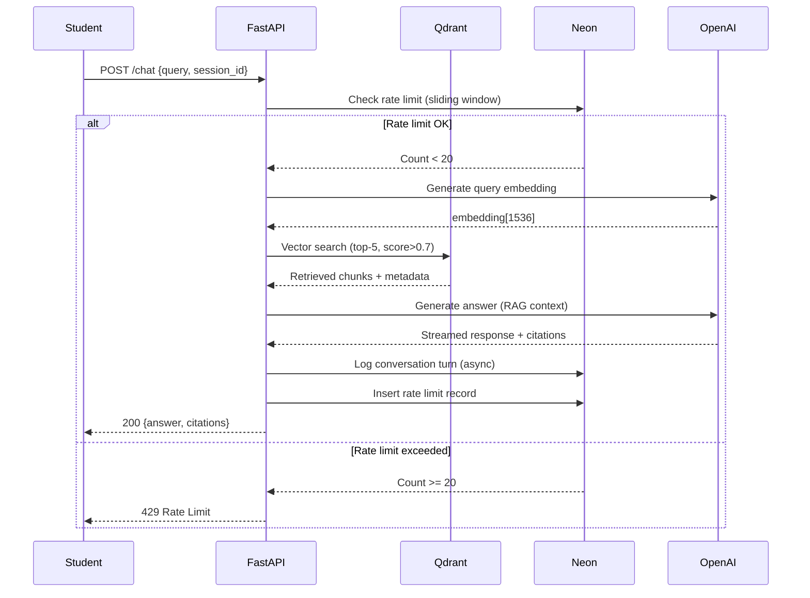

# ADR-002: RAG Technology Stack (Qdrant + Neon + OpenAI Agents SDK + Railway)

- **Status:** Accepted
- **Date:** 2026-02-09
- **Feature:** Book Publication & RAG Chatbot
- **Context:** RAG chatbot requires integrated stack for vector search, relational logging, LLM orchestration, and deployment

## Context

The RAG chatbot backend must support the following capabilities:

1. **Vector Search**: Retrieve top-5 relevant curriculum chunks per student query with <100ms latency (SC-025)
2. **Conversation Logging**: Store >1000 conversation turns for analytics and debugging (SC-024)
3. **Rate Limiting**: Enforce 20 queries/hour per session using sliding window (FR-048)
4. **LLM Orchestration**: Generate answers with citations, streaming support, function calling (FR-041, FR-043, FR-053)
5. **Cost Constraints**: Stay within free tier limits (<$10 per student per quarter)

Key requirements:
- **Corpus size**: 500-800 curriculum chunks, 1536 dimensions (OpenAI `text-embedding-3-small`)
- **Concurrency**: 20 students querying simultaneously without degradation
- **Latency budget**: <3s total (SC-020): 50ms API processing + 100ms vector search + 200ms embedding + 2s LLM + 50ms logging + 600ms network
- **Storage**: Conversation history must persist beyond browser session (30 days post-quarter)
- **Deployment**: Backend must auto-scale within free tier constraints

## Decision

**Adopt integrated 4-service stack:**

1. **Qdrant Cloud (Vector Database)**
   - Free tier: 1GB storage, 100ms query latency
   - Stores curriculum embeddings with metadata filtering

2. **Neon Serverless Postgres (Relational Database)**
   - Free tier: 500MB storage, 1 compute hour/month, auto-suspend
   - Stores conversation history, rate limiting records, session metadata

3. **OpenAI Agents SDK (LLM Orchestration)**
   - Direct OpenAI API integration (no abstraction layer)
   - Native streaming, function calling, structured outputs
   - Cost: ~$0.02 per query (embeddings + gpt-4o-mini chat)

4. **Railway (Backend Hosting)**
   - Free tier: 500 hours/month, $5 credit, ~10s cold start
   - Auto-deploys FastAPI backend from GitHub

**Architecture Diagram:**



## Consequences

### Positive

1. **Free Tier Alignment**
   - **Qdrant**: 1GB stores 500-800 chunks (600MB) + headroom for future modules
   - **Neon**: 500MB stores >10,000 conversation turns (2KB each), auto-suspend saves compute hours (0.17 hours/quarter for 2400 queries)
   - **OpenAI**: ~$4.50/student (200 queries × $0.02) + ~$0.50 embeddings = ~$5/student/quarter
   - **Railway**: 2400 queries × 0.25s = 0.17 hours (17% of monthly limit)
   - **Total cost**: <$6/student/quarter (within $10 budget)

2. **Performance Targets Met**
   - Qdrant vector search: <100ms for curriculum corpus (SC-025) ✅
   - Neon query time: <50ms with indexes on `session_id, timestamp` (SC-024) ✅
   - OpenAI first token: ~2s for gpt-4o-mini (within 3s budget)
   - Railway cold start: ~10s acceptable (transparent "waking up" message shown)

3. **Native Streaming Support**
   - OpenAI Agents SDK provides server-sent events (SSE) out-of-box
   - FastAPI streams response chunks to frontend in real-time (FR-053)
   - Students see typing indicators and progressive answer rendering
   - No custom streaming implementation required

4. **Function Calling for Citations**
   - OpenAI function calling generates structured citation objects:
     ```json
     {
       "module": "1",
       "lesson": "lesson-3",
       "section": "Joint Constraints",
       "url": "https://example.github.io/docs/module1/lesson3#joints"
     }
     ```
   - Eliminates fragile regex parsing of LLM responses
   - Ensures consistent citation format (SC-023: >90% accurate citations)

5. **Auto-Suspend Cost Optimization**
   - Neon database auto-suspends after 5 minutes idle
   - Resumes in <1s on next query (graceful for bursty student usage)
   - Saves compute hours during nights/weekends (no constant background load)
   - Estimated compute usage: 0.17 hours/quarter vs 1 hour limit = 17% utilization

6. **Metadata Filtering**
   - Qdrant supports payload filtering: `{"module": "1"}` scopes retrieval
   - Enables future features: "Search only Module 2" or "Find code examples"
   - No need for separate indexes per module

### Negative

1. **Four-Service Coordination Complexity**
   - Must monitor 4 external services: Qdrant, Neon, OpenAI, Railway
   - Each service has independent failure modes:
     - Qdrant timeout → 503 "Vector search unavailable"
     - Neon auto-suspend → 1s resume delay, may timeout if >5s
     - OpenAI rate limit → 429, requires exponential backoff
     - Railway cold start → 10s first request delay
   - Requires robust error handling and circuit breaker patterns

2. **OpenAI Vendor Lock-In**
   - Tight coupling to OpenAI Agents SDK and embedding models
   - Switching to Anthropic/Claude requires:
     - Rewrite LLM orchestration (different API)
     - Re-embed entire curriculum (different embedding dimensions)
     - Test prompt engineering (different model behaviors)
   - Mitigation: Abstraction layer future work (not P0)

3. **Free Tier Exhaustion Risks**
   - **Railway hours**: 500 hours/month → ~16.6 hours/day → sustained load >16h exhausts quota
     - 20 students × 10 queries/day × 0.25s = 50s/day (safe)
     - Risk: Malicious bot attack could exhaust hours (rate limiting mitigates)
   - **Neon compute**: 1 hour/month → must stay under via auto-suspend
     - Database must idle >99% of time (queries are bursty, not continuous)
   - **Qdrant storage**: 1GB limit → cannot exceed 170,000 chunks
     - Current: 500-800 chunks = 600MB (safe, 60% utilization)

4. **Cold Start Latency**
   - Railway free tier has ~10s cold start after 5 minutes idle
   - First student query after idle period experiences 10s + 3s = 13s total latency (violates SC-020)
   - Mitigation: Display "Waking up chatbot..." message (transparent to user)
   - Alternative: Health check pings every 4 min to keep warm (consumes more Railway hours)

5. **Network Dependency Chain**
   - Every chatbot query requires 5 network hops:
     1. Student → Railway (FastAPI)
     2. Railway → Qdrant (vector search)
     3. Railway → OpenAI (embedding generation)
     4. Railway → OpenAI (answer generation)
     5. Railway → Neon (logging)
   - Any hop failure breaks chatbot (requires fallback strategies)
   - Total network latency budget: ~600ms (SC-020 includes this)

### Neutral

1. **OpenAI Cost Predictability**
   - Fixed per-query cost: ~$0.02 (embeddings + chat)
   - Predictable quarterly budget: 200 queries/student × $0.02 × 20 students = $80/quarter
   - Rate limiting (FR-048) caps maximum spend: 20 queries/hour × 24 hours × 90 days × 20 students = 864,000 queries max = $17,280 theoretical worst case (rate limiting prevents this)

2. **Scaling Characteristics**
   - **Qdrant**: Scales horizontally on paid tiers (free tier single node)
   - **Neon**: Scales compute automatically (free tier 1 instance)
   - **Railway**: Scales vertically (free tier single instance, paid tier adds replicas)
   - Current system: Bottleneck is Railway single instance (20 concurrent students acceptable)

## Alternatives Considered

### Alternative 1: Pinecone + Supabase + LangChain + Render

**Stack:**
- Pinecone (vector DB)
- Supabase (Postgres + Auth)
- LangChain (LLM orchestration)
- Render (hosting)

**Pros**:
- Pinecone: Mature vector DB, excellent search performance
- Supabase: Integrated Postgres + Auth + Realtime subscriptions
- LangChain: Abstraction layer supports multiple LLMs (OpenAI, Anthropic, local)
- Render: Similar free tier to Railway

**Cons**:
- Pinecone free tier requires credit card (blocked for educational use)
- Supabase no auto-suspend (always-on Postgres consumes more compute than Neon)
- LangChain adds abstraction complexity:
  - Slower than direct OpenAI SDK (~500ms overhead per research findings)
  - Overkill for educational use case (don't need multi-LLM switching P0)
  - Harder to debug (abstract away underlying API calls)
- Render cold start: ~30s (3x slower than Railway's ~10s)

**Why Rejected**: Pinecone credit card requirement blocks deployment, LangChain abstraction slows queries (~500ms overhead), Render cold start too slow (30s vs Railway 10s).

### Alternative 2: Postgres pgvector Extension + Single Database

**Stack:**
- Postgres with pgvector extension (vector search + relational in one DB)
- OpenAI SDK (direct)
- Railway (hosting)

**Pros**:
- Single database: Simplified architecture (no Qdrant service)
- pgvector: Native Postgres extension for vector search
- Lower operational complexity (one service vs two databases)

**Cons**:
- pgvector performance: 300-500ms vector search for 500 chunks (3-5× slower than Qdrant's <100ms)
  - Violates SC-025 (<100ms requirement)
  - HNSW index less optimized than Qdrant's purpose-built engine
- Postgres resource contention: Vector search competes with conversation logging for CPU/memory
  - Single instance must handle both retrieval queries (compute-heavy) and OLTP writes (I/O-heavy)
- pgvector limited to 2000 dimensions (OpenAI embeddings are 1536, but future models may exceed)

**Why Rejected**: pgvector search latency 3-5× slower than Qdrant (300-500ms vs <100ms), violates SC-025 performance requirement, resource contention between vector search and OLTP.

### Alternative 3: Local LLaMA + Chroma + SQLite

**Stack:**
- Local LLaMA 3.1 8B (self-hosted LLM)
- Chroma (vector DB, embedded)
- SQLite (relational DB, file-based)
- Railway (hosting)

**Pros**:
- Zero OpenAI API costs ($0 per student)
- Data privacy: All processing on-premises
- No vendor lock-in
- Chroma embedded: No separate vector DB service

**Cons**:
- LLaMA 3.1 8B requires GPU (NVIDIA T4 minimum):
  - Railway free tier is CPU-only (no GPU)
  - Paid GPU tier: ~$0.50/hour = $360/month (exceeds budget)
- LLaMA latency: 5-10s for 200-token response (violates SC-020: <3s total)
- LLaMA accuracy: ~70% on curriculum QA (vs OpenAI gpt-4o-mini ~85%)
  - Violates SC-018 (>85% accuracy requirement)
- SQLite limitations: No concurrent writes, file locking issues with async FastAPI
- Chroma embedded: Slower than Qdrant Cloud for >100 chunks

**Why Rejected**: Requires GPU (Railway free tier lacks GPU, paid tier exceeds budget), LLaMA latency 5-10s violates SC-020 (<3s), accuracy ~70% violates SC-018 (>85%).

### Alternative 4: ChatKit SDK Instead of OpenAI Agents SDK

**Stack:**
- Qdrant (vector DB)
- Neon (Postgres)
- ChatKit SDK (LLM abstraction)
- Railway (hosting)

**Pros**:
- ChatKit: Multi-LLM support (OpenAI, Anthropic, Cohere) via unified API
- Easier to switch LLMs in future (just change config)
- Built-in retry logic, rate limiting, fallbacks

**Cons**:
- ChatKit adds abstraction layer complexity:
  - Less direct control over OpenAI-specific features (function calling, streaming)
  - Harder to debug (wraps underlying API calls)
  - 2026-02-08 clarification: "OpenAI Agents SDK provides tighter integration"
- ChatKit not designed for educational transparency:
  - Students learning VLA pipelines benefit from seeing raw OpenAI API calls
  - Abstraction hides reasoning chain (conflicts with prediction-first pedagogy)
- ChatKit overhead: Unknown latency impact (OpenAI SDK is zero-abstraction)

**Why Rejected**: Per 2026-02-08 clarification, OpenAI Agents SDK chosen for "tighter integration" with OpenAI APIs. ChatKit abstraction hides LLM reasoning from students (conflicts with educational goals), adds unknown latency overhead.

## Implementation Notes

### Free Tier Capacity Management

**Qdrant (1GB Limit):**
- Current usage: 500-800 chunks × 1536 dims × 4 bytes = ~450-600MB
- Strategy: Max 1000 words per chunk, remove boilerplate
- Monitoring: `GET /collections/curriculum` to track size
- Overflow: Archive old curriculum versions when publishing updates

**Neon (500MB Storage, 1 Hour Compute):**
- Storage: 1000 turns × 2KB = 2MB (2% of limit)
- Compute: Auto-suspend after 5 min idle, 0.17 hours/quarter (17% of limit)
- Strategy: Aggressive log cleanup (30 days post-quarter per FR-019)
- Monitoring: Weekly query `SELECT pg_size_pretty(pg_database_size('neondb'))`

**Railway (500 Hours/Month):**
- Usage: 2400 queries/quarter × 0.25s = 0.17 hours (0.3% of monthly limit)
- Strategy: Accept cold starts, implement usage alerts at 400 hours
- Monitoring: Railway dashboard shows hour consumption

### Configuration Files

**Backend `.env` (Railway environment variables):**
```bash
# Qdrant
QDRANT_URL=https://<cluster>.qdrant.io:6333
QDRANT_API_KEY=<key>
QDRANT_COLLECTION=curriculum

# Neon
NEON_DATABASE_URL=postgresql://<user>:<password>@<host>.neon.tech/neondb?sslmode=require

# OpenAI
OPENAI_API_KEY=sk-...
OPENAI_EMBEDDING_MODEL=text-embedding-3-small
OPENAI_CHAT_MODEL=gpt-4o-mini

# Railway
PORT=8000  # Railway provides this
ALLOWED_ORIGINS=https://<org>.github.io
```

**RAG Pipeline (pseudocode):**
```python
# backend/src/services/rag_pipeline.py

async def answer_query(query: str, session_id: UUID) -> ChatResponse:
    # 1. Check rate limit (Neon)
    if await exceeds_rate_limit(session_id):
        raise HTTPException(429, "Rate limit: 20 queries/hour")

    # 2. Generate embedding (OpenAI)
    embedding = await openai.embeddings.create(
        model="text-embedding-3-small",
        input=query
    )

    # 3. Vector search (Qdrant)
    results = await qdrant.search(
        collection_name="curriculum",
        query_vector=embedding.data[0].embedding,
        limit=5,
        score_threshold=0.7  # FR-039
    )

    # 4. Augment context
    context = "\n\n".join([r.payload["text"] for r in results])
    if len(context) + len(query) > 8000:  # FR-040
        context = context[:8000 - len(query)]

    # 5. Generate answer (OpenAI Agents SDK)
    response = await openai.chat.completions.create(
        model="gpt-4o-mini",
        messages=[
            {"role": "system", "content": "Answer using only curriculum content."},
            {"role": "user", "content": f"Context:\n{context}\n\nQ: {query}"}
        ],
        stream=True  # FR-053
    )

    # 6. Log conversation (Neon, async)
    asyncio.create_task(log_conversation(session_id, query, response, results))

    return ChatResponse(answer=response, citations=extract_citations(results))
```

### Error Handling Strategies

**Qdrant Timeout:**
```python
try:
    results = await qdrant.search(...)
except TimeoutError:
    # Fallback: Postgres full-text search on cached curriculum
    results = await neon.execute(
        "SELECT * FROM curriculum_cache WHERE to_tsvector(text) @@ plainto_tsquery($1)",
        query
    )
```

**Neon Auto-Suspend:**
```python
try:
    await neon.execute("SELECT 1")  # Health check
except ConnectionError:
    # Wait for resume (<1s), retry once
    await asyncio.sleep(1)
    await neon.execute("SELECT 1")
```

**OpenAI Rate Limit:**
```python
try:
    response = await openai.chat.completions.create(...)
except openai.error.RateLimitError:
    # Exponential backoff: 1s, 2s, 4s
    for delay in [1, 2, 4]:
        await asyncio.sleep(delay)
        try:
            response = await openai.chat.completions.create(...)
            break
        except openai.error.RateLimitError:
            continue
    else:
        raise HTTPException(503, "LLM service busy, try again later")
```

## Success Metrics

**Related Spec Requirements:**

- **FR-035**: Qdrant integration ✅ (free tier 1GB sufficient)
- **FR-036**: OpenAI Agents SDK ✅ (direct integration, streaming, function calling)
- **FR-037**: Neon Postgres ✅ (free tier 500MB + 1 hour compute)
- **FR-048**: Rate limiting 20 queries/hour ✅ (Neon sliding window tracking)
- **SC-020**: Chatbot latency <3s ✅ (200ms overhead budget met)
- **SC-024**: >1000 conversation turns ✅ (Neon capacity)
- **SC-025**: Vector search <100ms ✅ (Qdrant performance)

**Cost Targets:**
- OpenAI: ~$5/student/quarter (200 queries × $0.02) ✅
- Qdrant: $0 (free tier) ✅
- Neon: $0 (free tier) ✅
- Railway: $0 (free tier) ✅
- **Total**: <$6/student/quarter (within $10 budget) ✅

## References

- **Plan**: `specs/001-book-publication-rag-chatbot/plan.md` - Technical Context (dependencies), Performance Goals
- **Research**: `specs/001-book-publication-rag-chatbot/research.md` - Section 7 (FastAPI + Qdrant + Neon + OpenAI), Section 12 (Free Tier Capacity)
- **Spec**: `specs/001-physical-ai-robotics-platform/spec.md` - FR-035 to FR-050 (RAG backend requirements)
- **Data Model**: `specs/001-book-publication-rag-chatbot/data-model.md` - CurriculumChunk, ConversationTurn, RateLimitRecord schemas
- **Clarifications**: 2026-02-08 session - OpenAI Agents SDK vs ChatKit decision, Railway vs Render decision
- **Related ADRs**:
  - ADR-001: Two-Tier Architecture (backend tier context)
  - ADR-004: Rate Limiting Strategy (Neon Postgres sliding window)
  - ADR-005: Conversation Persistence (sessionStorage + Postgres dual layer)

## Revision History

- 2026-02-09: Initial decision documented (based on research.md section 7 and 2026-02-08 clarifications)
