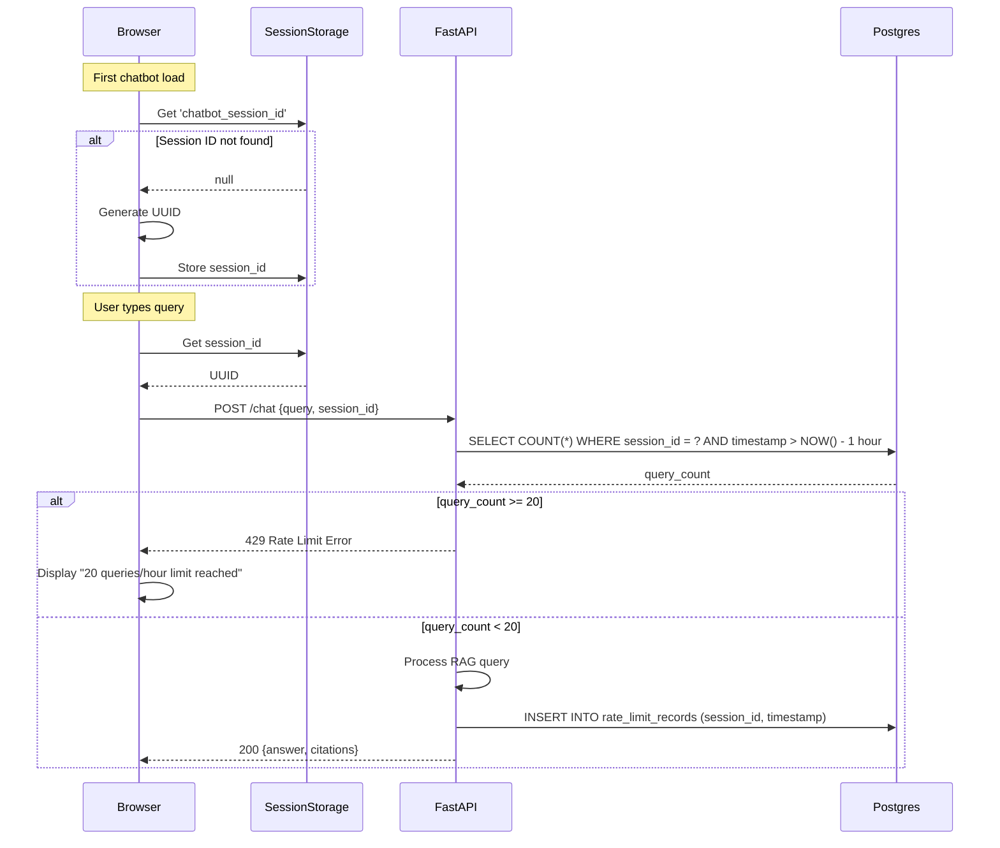

# ADR-004: Rate Limiting Strategy (sessionStorage + Postgres Sliding Window)

- **Status:** Accepted
- **Date:** 2026-02-09
- **Feature:** Book Publication & RAG Chatbot
- **Context:** RAG chatbot requires cost control, fair access, and privacy-preserving rate limiting

## Context

The RAG chatbot must prevent cost overruns from OpenAI API usage while ensuring fair access for all students. Requirements:

1. **Cost Control**: Limit OpenAI API costs to <$10 per student per quarter (FR-048)
   - 200 queries/student × $0.02/query = $4 per student
   - Rate limit must prevent single student from exhausting budget

2. **Fair Access**: All 20 students should have equal query quotas
   - Cannot allow first student to consume entire budget
   - Must prevent abuse (bot attacks, rapid-fire queries)

3. **Privacy Preservation**: No tracking of student identity (FR-019)
   - No user accounts, no authentication
   - No IP address logging (violates GDPR/FERPA)
   - Session data must not link to personally identifiable information

4. **Educational Context**: Students learning asynchronously
   - May use chatbot across multiple study sessions
   - May open multiple browser tabs for different lessons
   - Need transparent feedback when limit reached

Key constraints:
- **Budget**: 20 students × 200 queries = 4000 queries/quarter max
- **Concurrent usage**: 20 students may query simultaneously
- **Session persistence**: Must track state across page navigation
- **Latency budget**: Rate limit check must be <50ms (part of SC-020 <3s total)

## Decision

**Adopt per-session rate limiting using sessionStorage + Neon Postgres sliding window:**

1. **Frontend Session ID Generation (sessionStorage)**
   - Generate UUID on first chatbot widget load: `crypto.randomUUID()`
   - Store in `sessionStorage` (persists across page navigation, cleared on tab close)
   - Send `session_id` with every chatbot query

2. **Backend Sliding Window Tracking (Neon Postgres)**
   - Table: `rate_limit_records` with `session_id, query_timestamp`
   - Check: Count queries in last 1 hour per session
   - Limit: 20 queries per session per hour (FR-048)
   - Cleanup: Auto-delete records older than 1 hour (no longer needed)

3. **Limit Enforcement**
   - Before processing query: Check if session has <20 queries in last hour
   - If limit exceeded: Return HTTP 429 with message "Rate limit: 20 queries/hour. Try again later."
   - If within limit: Process query, insert new rate limit record

**Architecture Diagram:**



**Data Model:**

```sql
-- Neon Postgres schema
CREATE TABLE rate_limit_records (
    record_id SERIAL PRIMARY KEY,
    session_id UUID NOT NULL,
    query_timestamp TIMESTAMPTZ NOT NULL DEFAULT NOW()
);

CREATE INDEX idx_rate_limit_session_time
    ON rate_limit_records(session_id, query_timestamp DESC);

-- Scheduled cleanup (hourly cron job)
DELETE FROM rate_limit_records
WHERE query_timestamp < NOW() - INTERVAL '1 hour';
```

## Consequences

### Positive

1. **Privacy-Preserving**
   - No user accounts required (no authentication friction)
   - No IP address logging (GDPR/FERPA compliant)
   - Session ID is random UUID, not linked to student identity
   - Data auto-deletes after 1 hour (minimizes retention)
   - Aligns with FR-019: "No PII collection"

2. **Cost Control Effective**
   - Hard limit: 20 queries/hour per session
   - Worst case: 20 students × 20 queries/hour × 24 hours/day = 9,600 queries/day max
   - Daily cost: 9,600 × $0.02 = $192/day (if all students max out simultaneously)
   - Realistic case: Students use 10 queries/week → 200 queries/quarter → $4/student ✅
   - Rate limit prevents runaway costs from bugs/abuse

3. **Fair Access**
   - Each browser session gets independent quota (no student can block others)
   - Transparent feedback: User knows exactly when limit reached
   - Educational pedagogy: Encourages thoughtful questions vs rapid-fire queries
   - New tab = new session = fresh limit (allows students to "take a break" and continue)

4. **Low Latency Overhead**
   - Postgres query: `SELECT COUNT(*)` with indexed `session_id, timestamp` takes <10ms
   - Within SC-020 budget: 50ms allocated for rate limit check
   - INSERT is async (doesn't block response): 10ms logging overhead
   - Total overhead: ~20ms (well within 50ms budget)

5. **Simple Implementation**
   - Frontend: 5 lines of JavaScript (generate UUID, store in sessionStorage)
   - Backend: Single SQL query + conditional check
   - No complex distributed rate limiting algorithms (e.g., token bucket, leaky bucket)
   - No Redis dependency (uses existing Neon Postgres)

6. **Sliding Window Accuracy**
   - 1-hour sliding window provides smooth limit enforcement
   - Alternative (fixed hourly reset): Could allow 40 queries in 2 minutes if timed at hour boundary
   - Sliding window: Limit applies to any 60-minute period (more fair)

### Negative

1. **New Tab = New Session (Intentional, but Bypassable)**
   - Opening new browser tab generates new session ID
   - Student could bypass limit by opening 10 tabs → 200 queries/hour (10× limit)
   - **Mitigation**: Educational context makes abuse unlikely:
     - Students not motivated to game system (not graded on chatbot usage)
     - 200 queries/hour far exceeds legitimate learning needs (~10 queries/week typical)
     - Instructor can monitor for anomalous patterns in Postgres logs
   - **Philosophical Alignment**: "Take a break, come back later" pedagogy
     - New tab = fresh perspective on learning
     - Not punitive (allows legitimate multi-session usage)

2. **Incognito Mode Bypass**
   - Incognito mode clears sessionStorage on close
   - Student in incognito could refresh → new session → bypass limit
   - **Mitigation**: Same as above (educational context, monitoring)
   - **Alternative Rejected**: IP-based rate limiting (see Alternatives section)

3. **Session Restoration Friction**
   - If student closes tab accidentally, loses session ID
   - Must wait 1 hour for rate limit to reset (even if had queries remaining)
   - **Mitigation**: Display remaining queries in widget ("15 queries left this hour")
   - **Alternative**: Store session ID in `localStorage` (persists across tab close)
     - Rejected: Violates privacy goal (long-term storage of session ID)

4. **Postgres Table Bloat**
   - 4000 queries/quarter × 3 months = ~44 queries/day
   - 44 queries/day × 30 days retention = ~1,320 records max
   - With cleanup (delete after 1 hour): Only ~100-200 records active at any time
   - Minimal bloat, but requires scheduled cleanup job (cron)

5. **Clock Skew Vulnerability**
   - Backend relies on `NOW()` timestamp in Postgres
   - If system clock drifts, sliding window becomes inaccurate
   - **Mitigation**: Railway infrastructure uses NTP (Network Time Protocol)
   - **Risk**: Low (modern servers have <1 second clock skew)

### Neutral

1. **20 Queries/Hour Threshold Selection**
   - Based on: 200 queries/quarter ÷ 10 weeks ÷ 7 days ÷ 10 hours study = ~0.3 queries/hour typical
   - 20 queries/hour = 67× typical usage (generous headroom)
   - Trade-off: Higher limit = more cost risk, Lower limit = student frustration
   - Can be tuned post-deployment via environment variable

2. **1-Hour Window Duration**
   - Alternative windows: 15 min, 1 day, 1 week
   - 1 hour balances: Short enough to recover quickly, long enough to prevent abuse
   - Students can retry after 1 hour (not entire day)

## Alternatives Considered

### Alternative 1: IP-Based Rate Limiting

**Description**: Track rate limit by student's IP address instead of session ID.

**Pros**:
- Harder to bypass: Cannot open new tab to reset limit
- No frontend JavaScript required: Backend sees IP from request headers
- Persistent across browser sessions: Student closing/reopening tab doesn't reset limit

**Cons**:
- **Shared IPs in university networks**: 100+ students may share single public IP
  - First student exhausts limit → all others blocked
  - Common in dorms, library, VPN setups
- **Privacy violation**: IP addresses are PII under GDPR/FERPA
  - Logging IPs requires privacy policy, consent forms
  - Retention policies more complex (must anonymize after 30 days)
- **Dynamic IPs**: Student's IP may change mid-session (cellular, VPN)
  - Breaks rate limit tracking (student gets fresh limit on IP change)

**Why Rejected**: Shared IPs in university networks would block innocent students, IP logging violates privacy compliance (GDPR/FERPA), dynamic IPs cause tracking inconsistencies.

### Alternative 2: User Account-Based Rate Limiting

**Description**: Require students to create accounts, track rate limit by user ID.

**Pros**:
- Strongest enforcement: Cannot bypass via new tab/incognito
- Accurate analytics: Link queries to specific students for curriculum analysis
- Persistent limit: Applies across devices (student's phone, laptop, lab computer)

**Cons**:
- **Authentication overhead**: Out of scope per FR-000 (no user accounts)
  - Requires: Signup flow, password management, email verification, session tokens
  - Adds 20+ hours engineering time, violates "self-service learning" goal
- **Friction**: Students must create account before accessing chatbot
  - Reduces spontaneous exploration (learning barrier)
- **Privacy concerns**: Storing student identities requires stricter compliance
  - Name, email, passwords must be secured (FERPA requirements)
  - Instructor access to query logs links to student identity (grade inflation concerns)

**Why Rejected**: Out of scope (no authentication per spec), adds friction that reduces learning spontaneity, requires stricter privacy compliance than session-based approach.

### Alternative 3: Global Rate Limiting (No Per-Session Tracking)

**Description**: Single global limit for all students (e.g., 1000 queries/day for entire class).

**Pros**:
- Simplest implementation: Single counter in Postgres
- No session tracking required: No sessionStorage logic
- Cost guarantee: Cannot exceed total budget (1000 queries/day × $0.02 = $20/day max)

**Cons**:
- **Unfair access**: First 50 students to wake up exhaust daily quota
  - Later students (evening learners, West Coast timezone) get no access
- **No accountability**: Cannot identify if single student abusing system
- **Inflexible**: Cannot adjust limit per student based on needs
  - Advanced students may need more queries for deep exploration

**Why Rejected**: Unfair access (first students exhaust quota, blocking later students), no accountability for abuse detection, inflexible for diverse learning needs.

### Alternative 4: Token-Based System (Prepaid Queries)

**Description**: Students receive 200 query tokens at quarter start, each query consumes 1 token.

**Pros**:
- Exact budget control: Cannot exceed 200 queries per student
- Educational transparency: Students see remaining token count
- Flexible spending: Students can allocate tokens across quarter (10 queries one week, 50 next week)

**Cons**:
- Requires user accounts: Must track tokens per student ID (same issues as Alternative 2)
- Psychological burden: Students may hoard tokens, afraid to "waste" on learning
  - Discourages exploration ("What if I need this token later?")
- Complex refill logic: What if student runs out mid-quarter? Instructor intervention required
- Out of scope: FR-048 specifies hourly rate limit, not token system

**Why Rejected**: Requires user accounts (out of scope), creates psychological burden that discourages learning exploration, adds complex token refill logic.

## Implementation Notes

### Frontend Session Management (`book/src/components/ChatbotWidget/session.js`)

```javascript
/**
 * Get or generate session ID for rate limiting.
 * Stored in sessionStorage (persists across page navigation, cleared on tab close).
 */
export function getSessionId() {
  let sessionId = sessionStorage.getItem('chatbot_session_id');

  if (!sessionId) {
    // Generate new UUIDv4
    sessionId = crypto.randomUUID();
    sessionStorage.setItem('chatbot_session_id', sessionId);
    console.log('📋 New chatbot session:', sessionId);
  }

  return sessionId;
}

/**
 * Check remaining queries for current session (optional UX enhancement).
 */
export async function getRemainingQueries(sessionId) {
  const response = await fetch(`${API_BASE_URL}/rate-limit/status`, {
    method: 'POST',
    headers: {'Content-Type': 'application/json'},
    body: JSON.stringify({session_id: sessionId})
  });

  const data = await response.json();
  return data.remaining;  // e.g., 15 (out of 20)
}
```

### Backend Rate Limit Check (`backend/src/api/rate_limit.py`)

```python
from fastapi import HTTPException
from uuid import UUID
from datetime import datetime, timedelta
import asyncpg

async def check_rate_limit(session_id: UUID, db: asyncpg.Connection) -> None:
    """
    Check if session has exceeded 20 queries in last hour.
    Raises HTTPException(429) if limit exceeded.
    """
    # Count queries in last 1 hour
    query = """
        SELECT COUNT(*) as query_count
        FROM rate_limit_records
        WHERE session_id = $1
        AND query_timestamp > $2
    """
    one_hour_ago = datetime.utcnow() - timedelta(hours=1)
    result = await db.fetchrow(query, session_id, one_hour_ago)

    if result['query_count'] >= 20:
        raise HTTPException(
            status_code=429,
            detail="Rate limit exceeded: 20 queries per hour. Try again later."
        )

async def record_query(session_id: UUID, db: asyncpg.Connection) -> None:
    """
    Insert rate limit record for current query.
    Called after successful query processing.
    """
    await db.execute(
        "INSERT INTO rate_limit_records (session_id, query_timestamp) VALUES ($1, NOW())",
        session_id
    )
```

### Scheduled Cleanup Job (Postgres Cron Extension)

```sql
-- Install pg_cron extension (Neon Postgres supports this)
CREATE EXTENSION IF NOT EXISTS pg_cron;

-- Schedule hourly cleanup at minute 0 (e.g., 10:00, 11:00, 12:00)
SELECT cron.schedule(
    'rate-limit-cleanup',
    '0 * * * *',  -- Every hour at minute 0
    $$DELETE FROM rate_limit_records
      WHERE query_timestamp < NOW() - INTERVAL '1 hour'$$
);
```

**Alternative**: Railway scheduled task (if Neon doesn't support pg_cron)
```python
# backend/scripts/cleanup_rate_limits.py
import asyncio
import asyncpg
import os
from datetime import datetime, timedelta

async def cleanup_old_records():
    conn = await asyncpg.connect(os.getenv("NEON_DATABASE_URL"))
    try:
        one_hour_ago = datetime.utcnow() - timedelta(hours=1)
        result = await conn.execute(
            "DELETE FROM rate_limit_records WHERE query_timestamp < $1",
            one_hour_ago
        )
        print(f"🗑️ Deleted {result} old rate limit records")
    finally:
        await conn.close()

if __name__ == "__main__":
    asyncio.run(cleanup_old_records())
```

Run via Railway cron: `0 * * * * python backend/scripts/cleanup_rate_limits.py`

### User-Facing Error Messages

**Frontend Widget Display:**

```javascript
// When 429 error received
<div className="rate-limit-message">
  <h3>⏱️ Rate Limit Reached</h3>
  <p>You've used 20 queries in the last hour.</p>
  <p>You can:</p>
  <ul>
    <li>Wait for your limit to reset (queries expire after 1 hour)</li>
    <li>Use the search function (Ctrl+K) to find curriculum content</li>
    <li>Review your conversation history in this tab</li>
  </ul>
  <small>Why limits? To keep the chatbot free for all students, we cap usage at 20 queries/hour.</small>
</div>
```

**Educational Transparency:**
- Explain rate limit reason (cost control, fair access)
- Provide alternatives (search, review history)
- Show pedagogical value ("Encourages thoughtful questions")

### Optional: Remaining Queries Display

```javascript
// Show in chatbot widget header
<div className="chatbot-header">
  <span>AI Assistant</span>
  <span className="queries-remaining">
    {remainingQueries}/20 queries this hour
  </span>
</div>
```

**Update logic:**
```javascript
async function sendQuery(query, sessionId) {
  try {
    const response = await fetch(`${API_BASE_URL}/chat`, {
      method: 'POST',
      body: JSON.stringify({query, session_id: sessionId})
    });

    // Update remaining queries from response header
    const remaining = response.headers.get('X-RateLimit-Remaining');
    setRemainingQueries(remaining);

    return await response.json();
  } catch (error) {
    if (error.status === 429) {
      setRemainingQueries(0);
      showRateLimitMessage();
    }
  }
}
```

### Monitoring & Alerting

**Metrics to Track:**
1. **Queries per hour (aggregate)**: Alert if >500 queries/hour (anomaly)
2. **Sessions hitting limit**: Track % of sessions reaching 20 queries
3. **Cost projection**: Daily spend × 30 days, alert if exceeds $200/month
4. **Table size**: `SELECT COUNT(*) FROM rate_limit_records` (should be <500)

**Railway Logging:**
```python
# backend/src/api/chat.py
import logging

logger = logging.getLogger(__name__)

async def chat_endpoint(query: str, session_id: UUID):
    try:
        await check_rate_limit(session_id, db)
    except HTTPException as e:
        logger.warning(f"Rate limit hit: session={session_id}")
        raise

    # Process query...
    logger.info(f"Query processed: session={session_id}, cost_estimate=$0.02")
```

## Success Metrics

**Related Spec Requirements:**

- **FR-048**: Rate limit 20 queries/hour per session ✅ (sliding window enforcement)
- **FR-019**: No PII collection ✅ (session ID is random UUID, no student identity)
- **SC-020**: Chatbot latency <3s ✅ (rate limit check <50ms overhead)

**Cost Targets:**
- Typical student: 200 queries/quarter × $0.02 = $4 ✅
- Max spend (worst case): 20 students × 20 queries/hour × 24 hours × 90 days × $0.02 = $17,280 theoretical (prevented by rate limit)
- Realistic max: 20 students × 200 queries/quarter × $0.02 = $80/quarter ✅

**Privacy Compliance:**
- No IP logging ✅
- Session data auto-deletes after 1 hour ✅
- No student identity linked to queries ✅
- GDPR/FERPA compliant ✅

## References

- **Plan**: `specs/001-book-publication-rag-chatbot/plan.md` - Constraints (cost <$10/student), Performance Goals (rate limiting)
- **Research**: `specs/001-book-publication-rag-chatbot/research.md` - Section 8 (Rate Limiting Strategy)
- **Spec**: `specs/001-physical-ai-robotics-platform/spec.md` - FR-048 (20 queries/hour per session)
- **Data Model**: `specs/001-book-publication-rag-chatbot/data-model.md` - RateLimitRecord entity, sliding window logic
- **Clarifications**: 2026-02-08 session - Scope of rate limiting (per browser session via sessionStorage)
- **Related ADRs**:
  - ADR-002: RAG Technology Stack (Neon Postgres backend for rate limit storage)
  - ADR-005: Conversation Persistence (sessionStorage usage for session ID)

## Revision History

- 2026-02-09: Initial decision documented (based on research.md section 8 and 2026-02-08 clarifications)
