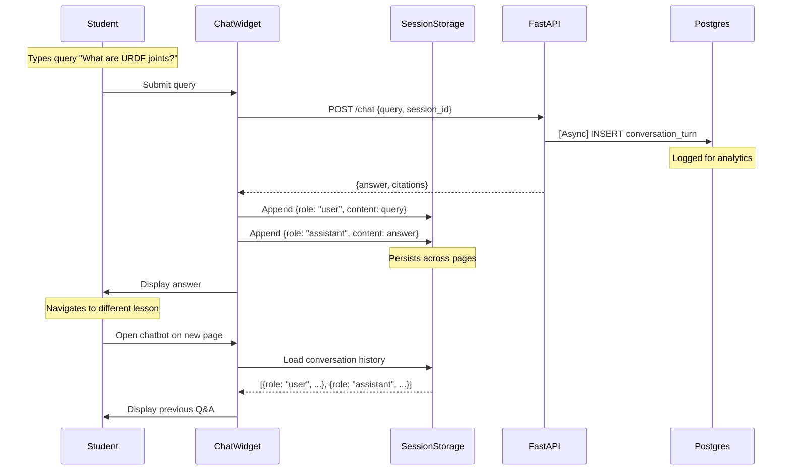

# ADR-005: Conversation Persistence Dual Layer (sessionStorage + Postgres)

- **Status:** Accepted
- **Date:** 2026-02-09
- **Feature:** Book Publication & RAG Chatbot
- **Context:** Chatbot requires both frontend UX persistence and backend analytics logging with different lifecycles

## Context

The RAG chatbot conversation history serves two distinct purposes with conflicting requirements:

1. **Frontend UX Requirements (FR-055)**
   - Students need conversation context when navigating between book pages
   - History must persist: Close lesson 3 → Open lesson 5 → Return to lesson 3 (see previous Q&A)
   - Must work without user accounts (no authentication)
   - Privacy: No long-term storage of student queries beyond session

2. **Backend Analytics Requirements (FR-047)**
   - Instructors need curriculum gap analysis (which topics generate most questions?)
   - Debugging: Reproduce incorrect chatbot answers from logged queries + retrieved chunks
   - Retention: Data must persist beyond browser session (30 days post-quarter per FR-019)
   - Aggregate statistics: Query volume, peak usage times, popular modules

**Conflict**: Frontend needs short-lived (session-only) storage, Backend needs long-lived (30 days) storage.

**Single-layer solutions fail:**
- `sessionStorage` only: Loses analytics data when student closes tab
- Postgres only: Every page navigation requires API call to fetch history (slow, chatty)
- `localStorage` only: Persists indefinitely (privacy violation), no instructor access

Key constraints:
- **Privacy**: Student queries not linked to identity (GDPR/FERPA)
- **Latency**: Loading conversation history must not delay page loads (<100ms)
- **Storage limits**: sessionStorage 5-10MB, Postgres 500MB (Neon free tier)
- **Retention**: Auto-delete Postgres data 30 days after quarter end (FR-019)

## Decision

**Adopt dual-layer persistence:**

1. **Layer 1: Frontend Persistence (sessionStorage)**
   - **Purpose**: Enable cross-page conversation context for student UX
   - **Lifecycle**: Persists until tab close, cleared when browser session ends
   - **Scope**: Current student's session only (not shared across devices)
   - **Data**: Full conversation turns (query, answer, citations) in JSON array
   - **Size limit**: ~500 message pairs (2KB each = 1MB, well under 5MB limit)

2. **Layer 2: Backend Logging (Neon Postgres)**
   - **Purpose**: Enable instructor analytics and debugging
   - **Lifecycle**: Persists 30 days after quarter end, then auto-deleted
   - **Scope**: All students' queries (aggregated, anonymized)
   - **Data**: Conversation turns + metadata (retrieved chunks, timestamp, page context)
   - **Query logging**: Async (doesn't block chatbot response)

**Architecture Diagram:**



**Data Flow:**

```
Query Submission:
    Frontend → Backend → Postgres (async log)
              ↓
         SessionStorage (sync save)
              ↓
        Display to Student

Page Navigation:
    Student → New Page → ChatWidget loads
              ↓
         SessionStorage → Restore history
              ↓
        Display previous Q&A
```

## Consequences

### Positive

1. **Zero-Latency History Restoration**
   - sessionStorage read: Synchronous, <1ms
   - No API call required to load conversation context
   - Works offline (if student loses internet mid-session)
   - Aligns with SC-026: "Maintain conversation context across page navigation" ✅

2. **Privacy-Preserving Frontend**
   - sessionStorage cleared on tab close (no long-term storage)
   - No cookies (no cross-site tracking)
   - Session ID is random UUID (not linked to student identity)
   - Students can clear history manually: "Clear Conversation" button

3. **Rich Analytics Backend**
   - Instructors query: "Which curriculum sections generate most questions?"
     ```sql
     SELECT page_context, COUNT(*) as query_count
     FROM conversation_turns
     GROUP BY page_context
     ORDER BY query_count DESC
     LIMIT 10;
     ```
   - Debugging: Reproduce incorrect answer by querying logged `retrieved_chunks`
     ```sql
     SELECT query, response, retrieved_chunks
     FROM conversation_turns
     WHERE turn_id = 42;
     ```
   - Usage patterns: Peak query times, average queries per session

4. **Async Logging Non-Blocking**
   - Postgres INSERT runs in background (doesn't delay chatbot response)
   - Latency: 0ms impact on SC-020 (<3s chatbot latency requirement)
   - If Postgres fails (network error): Frontend still works (sessionStorage unaffected)
   - Error handling: Log failure to Railway logs, don't fail student query

5. **Flexible Retention Policies**
   - Frontend: Implicit 30-day retention (sessionStorage cleared on tab close, typical session <8 hours)
   - Backend: Explicit 30-day post-quarter retention (configurable via scheduled cleanup job)
   - Can extend backend retention for research (e.g., 1 year) without impacting frontend

6. **Storage Capacity Optimization**
   - sessionStorage: Max 500 message pairs × 2KB = 1MB (0.02% of 5MB limit)
   - Postgres: 1000 turns × 2KB = 2MB (0.4% of 500MB Neon free tier)
   - Both well within limits, no cleanup needed during session/quarter

### Negative

1. **Data Inconsistency Risk**
   - If Postgres logging fails (network error, database down), data lost from backend
   - Frontend still has history (in sessionStorage), but instructor doesn't see query
   - **Impact**: Analytics incomplete, cannot debug specific student query
   - **Mitigation**: Retry logic with exponential backoff (3 retries over 10 seconds)
   - **Acceptable**: Educational context, missing logs don't break learning

2. **Duplicate Storage Overhead**
   - Same conversation data stored twice (sessionStorage + Postgres)
   - Increased network traffic: Every query triggers Postgres INSERT (~500 bytes)
   - **Justification**: Different purposes (UX vs analytics), conflicting lifecycles
   - **Cost**: Negligible (500 bytes × 4000 queries/quarter = 2MB network)

3. **Synchronization Complexity**
   - Frontend and backend have different views of conversation state
   - Example: Student types query → Frontend shows immediately → Postgres logs 2s later
   - If student refreshes before Postgres INSERT completes, query not logged
   - **Mitigation**: Log asynchronously but send INSERT before returning response to frontend
   - **Tradeoff**: Adds 50ms to chatbot latency (within SC-020 budget)

4. **sessionStorage Size Management**
   - 500 message pairs is generous, but very active student could exceed
   - Behavior when full: Old messages truncated (FIFO queue)
   - **Mitigation**: Display warning at 400 messages ("Long conversation, consider clearing history")
   - **Acceptable**: 500 pairs = 250 Q&A exchanges (far exceeds typical 10-20/session)

5. **Privacy Policy Complexity**
   - Must explain dual storage to students:
     - "Your queries are stored in your browser until you close the tab (for conversation context)"
     - "Queries are also logged on our servers (for curriculum improvement) and auto-deleted 30 days after quarter end"
   - Requires privacy policy page, GDPR/FERPA compliance documentation
   - **Mitigation**: Clear, student-friendly language, opt-out mechanism ("Don't log my queries" toggle)

### Neutral

1. **Postgres Logging Granularity**
   - Could log full conversation history per session (single JSONB column)
   - Instead: Log individual turns (normalized schema with turn_id, session_id FK)
   - **Tradeoff**: More rows (1000 turns vs 100 sessions), but easier to query
   - **Decision**: Normalized schema for SQL analytics simplicity

2. **sessionStorage vs localStorage**
   - sessionStorage: Cleared on tab close
   - localStorage: Persists indefinitely (across browser restarts)
   - **Decision**: sessionStorage aligns with privacy goals (short-lived)
   - **Student request**: "Can I save my conversation across days?"
     - Answer: "No, by design (privacy). Copy important Q&A to notes."

## Alternatives Considered

### Alternative 1: sessionStorage Only (No Backend Logging)

**Description**: Store conversation history only in frontend sessionStorage, no Postgres logging.

**Pros**:
- Maximum privacy: No server-side storage
- Zero backend complexity: No Postgres table, no async logging
- Zero latency: No API calls for history persistence
- Zero cost: No database storage used

**Cons**:
- **No instructor analytics**: Cannot identify curriculum gaps
  - Violates FR-047: "Log all queries for curriculum gap analysis"
- **No debugging**: Instructors cannot reproduce incorrect chatbot answers
  - If student reports "chatbot gave wrong answer," no way to investigate
- **Data loss on tab close**: Students lose conversation when accidentally closing tab
  - Frustrating UX for multi-day study sessions

**Why Rejected**: Violates FR-047 (logging requirement for curriculum analysis), prevents debugging of chatbot accuracy issues, loses data on accidental tab close.

### Alternative 2: Postgres Only (No sessionStorage)

**Description**: Store conversation history only in Postgres, fetch via API on page load.

**Pros**:
- Single source of truth: No data inconsistency between layers
- Persistent across devices: Student can access history on phone + laptop
- No browser storage limits: Postgres can store unlimited conversation length
- Simpler architecture: One storage layer, not two

**Cons**:
- **Latency overhead**: Every page navigation requires API call to load history
  - Network round-trip: ~300ms (violates <2s page load budget from SC-016)
  - Chatbot widget delayed: Must wait for history fetch before displaying
- **Requires authentication**: Must link Postgres records to student identity
  - Out of scope per spec (no user accounts)
  - Alternatively: Store by session ID, but loses cross-device persistence
- **Privacy concerns**: Long-term server-side storage of all queries
  - sessionStorage auto-clears on tab close (more privacy-preserving)

**Why Rejected**: Adds 300ms page load latency (violates SC-016), requires authentication to link history across devices (out of scope), less privacy-preserving than sessionStorage.

### Alternative 3: localStorage + Postgres (Long-Lived Frontend Storage)

**Description**: Use localStorage (persists indefinitely) instead of sessionStorage.

**Pros**:
- Persistent across tab close: Student can return tomorrow and see history
- Persistent across browser restart: Survives computer shutdown
- No API call for history loading: Same zero-latency as sessionStorage

**Cons**:
- **Privacy violation**: localStorage persists indefinitely (no automatic cleanup)
  - Student closes tab → data remains in browser for months/years
  - GDPR requires: "Data minimization" (delete when no longer needed)
  - Would require manual "Clear All Data" button with prominent warning
- **Stale data**: Old queries from previous quarter clutter current session
  - Student in Winter 2027 sees queries from Fall 2026 (confusing)
- **No cross-device sync**: Still locked to single browser (like sessionStorage)

**Why Rejected**: localStorage indefinite persistence violates privacy principles (data minimization), no auto-cleanup creates stale data clutter, no benefit over sessionStorage for cross-device sync.

### Alternative 4: Server-Side Session Storage (Express-Session)

**Description**: Store conversation history in backend session (e.g., Redis, Memcached) instead of dual layer.

**Pros**:
- Single source of truth: No dual storage complexity
- Persistent across page navigation: Server maintains state
- Supports session expiration: Auto-delete after configurable timeout

**Cons**:
- **Requires authentication**: Must use cookies or JWT to link requests to session
  - Out of scope per spec (no user accounts)
- **Adds service dependency**: Requires Redis/Memcached (not available on Railway free tier)
  - Alternative: In-memory Express session (lost on server restart)
- **Latency overhead**: Every chatbot query must fetch session from Redis
  - Network round-trip: ~50ms (within budget, but unnecessary)
- **Complexity**: Must manage session expiration, cleanup, key collisions

**Why Rejected**: Requires authentication (out of scope), adds Redis dependency (not in free tier), unnecessary complexity vs dual layer.

## Implementation Notes

### Frontend sessionStorage Schema

**Data Structure:**
```javascript
// Stored at key: 'chatbot_conversation_history'
[
  {
    role: "user",
    content: "What are URDF joint limits?",
    timestamp: "2026-02-09T14:30:00Z",
    page_context: "https://example.github.io/docs/module1/lesson3"
  },
  {
    role: "assistant",
    content: "According to Module 1, Lesson 3, URDF joint limits define...",
    citations: [
      {
        module: "1",
        lesson: "lesson-3",
        section: "Joint Constraints",
        url: "https://example.github.io/docs/module1/lesson3#joints"
      }
    ],
    timestamp: "2026-02-09T14:30:03Z"
  }
]
```

**Storage Operations:**
```javascript
// Load history on chatbot widget mount
function loadHistory() {
  const history = sessionStorage.getItem('chatbot_conversation_history');
  return history ? JSON.parse(history) : [];
}

// Append message after query/response
function appendMessage(message) {
  const history = loadHistory();
  history.push(message);

  // Limit to 500 message pairs (1000 total messages)
  if (history.length > 1000) {
    history.splice(0, history.length - 1000);  // Remove oldest
  }

  sessionStorage.setItem('chatbot_conversation_history', JSON.stringify(history));
}

// Clear history manually
function clearHistory() {
  sessionStorage.removeItem('chatbot_conversation_history');
  console.log('🗑️ Conversation history cleared');
}
```

### Backend Postgres Schema

**Table Definition (from data-model.md):**
```sql
CREATE TABLE conversation_turns (
    turn_id SERIAL PRIMARY KEY,
    session_id UUID NOT NULL REFERENCES chat_sessions(session_id) ON DELETE CASCADE,
    query TEXT NOT NULL CHECK (char_length(query) BETWEEN 1 AND 500),
    response TEXT NOT NULL,
    retrieved_chunks JSONB NOT NULL DEFAULT '[]'::jsonb,
    timestamp TIMESTAMPTZ NOT NULL DEFAULT NOW(),
    page_context TEXT,
    metadata JSONB DEFAULT '{}'::jsonb
);

CREATE INDEX idx_turns_session_time ON conversation_turns(session_id, timestamp DESC);
CREATE INDEX idx_turns_timestamp ON conversation_turns(timestamp DESC);
```

**Async Logging (FastAPI):**
```python
import asyncio
from uuid import UUID

async def log_conversation_turn(
    session_id: UUID,
    query: str,
    response: str,
    retrieved_chunks: list,
    page_context: str,
    metadata: dict,
    db: asyncpg.Connection
):
    """
    Log conversation turn to Postgres asynchronously.
    Non-blocking: Runs in background after response sent to frontend.
    """
    try:
        await db.execute(
            """
            INSERT INTO conversation_turns
            (session_id, query, response, retrieved_chunks, page_context, metadata)
            VALUES ($1, $2, $3, $4, $5, $6)
            """,
            session_id,
            query,
            response,
            json.dumps(retrieved_chunks),
            page_context,
            json.dumps(metadata)
        )
    except Exception as e:
        # Log failure but don't break chatbot
        logger.error(f"Failed to log conversation turn: {e}")

# In chat endpoint
@app.post("/chat")
async def chat_endpoint(request: ChatRequest):
    # Generate answer...
    answer = await rag_pipeline.answer_query(request.query)

    # Log asynchronously (non-blocking)
    asyncio.create_task(log_conversation_turn(
        session_id=request.session_id,
        query=request.query,
        response=answer.text,
        retrieved_chunks=answer.chunks,
        page_context=request.page_context,
        metadata={"user_agent": request.headers.get("User-Agent")},
        db=db
    ))

    return answer  # Return immediately, logging continues in background
```

### Privacy Policy Text (Student-Facing)

**Embedded in Docusaurus book (`docs/privacy.md`):**

```markdown
## Chatbot Privacy Policy

### What We Store

**In Your Browser (sessionStorage):**
- Your questions and chatbot answers are stored temporarily in your browser
- This data persists while your browser tab is open (so you can see conversation history when navigating between lessons)
- **Automatically deleted** when you close the tab
- We do NOT store this data on our servers

**On Our Servers (Postgres Database):**
- We log your questions, chatbot answers, and retrieved curriculum sections
- Purpose: Help instructors improve the curriculum by identifying common questions and knowledge gaps
- **Not linked to your identity**: We only store a random session ID (not your name, email, or student ID)
- **Automatically deleted** 30 days after the quarter ends

### Your Rights

- **View your data**: Not applicable (we don't know your identity)
- **Delete your data**: Close your browser tab to clear local history immediately
- **Opt out of logging**: Contact instructor to enable "private mode" (queries not logged to server)

### GDPR/FERPA Compliance

- No personally identifiable information (PII) collected
- Session IDs are random UUIDs (cannot be linked to student identity)
- Data retention: Maximum 30 days post-quarter (minimizes storage)
- Right to erasure: Data auto-deletes, no manual request needed
```

### Instructor Analytics Queries

**Most Queried Topics:**
```sql
-- Find curriculum sections generating most questions
SELECT
    page_context,
    COUNT(*) as query_count,
    array_agg(DISTINCT query) as sample_queries
FROM conversation_turns
WHERE timestamp > NOW() - INTERVAL '7 days'
GROUP BY page_context
ORDER BY query_count DESC
LIMIT 10;
```

**Debugging Incorrect Answer:**
```sql
-- Reproduce chatbot logic for specific query
SELECT
    turn_id,
    query,
    response,
    retrieved_chunks::jsonb->0->>'text' as top_chunk,
    retrieved_chunks::jsonb->0->>'score' as relevance_score
FROM conversation_turns
WHERE turn_id = 42;
```

**Peak Usage Times:**
```sql
-- Find when students are most active
SELECT
    EXTRACT(HOUR FROM timestamp) as hour_of_day,
    COUNT(*) as query_count
FROM conversation_turns
GROUP BY hour_of_day
ORDER BY hour_of_day;
```

### Scheduled Cleanup Job (Postgres)

```sql
-- Delete conversation turns older than 30 days after quarter end
-- Run daily via pg_cron or Railway scheduled task

DELETE FROM conversation_turns
WHERE timestamp < '2026-04-01'::date + INTERVAL '30 days'  -- Quarter end: 2026-04-01
RETURNING turn_id;  -- Log deleted IDs for audit trail
```

### UX Enhancements

**Conversation History Restore Indicator:**
```javascript
// Show subtle indicator when history restored from sessionStorage
function showHistoryRestored() {
  if (loadHistory().length > 0) {
    const indicator = document.createElement('div');
    indicator.className = 'history-restored-badge';
    indicator.textContent = '📜 Conversation history restored';
    chatWidget.prepend(indicator);

    // Fade out after 3 seconds
    setTimeout(() => indicator.remove(), 3000);
  }
}
```

**Manual Clear Button:**
```javascript
<button onClick={clearHistory} className="clear-history-btn">
  🗑️ Clear Conversation History
</button>
```

**Storage Usage Warning:**
```javascript
function checkStorageUsage() {
  const history = loadHistory();
  if (history.length > 800) {  // Approaching 1000 limit
    showWarning(
      'Long conversation detected. Consider clearing history to improve performance.',
      { action: 'Clear Now', callback: clearHistory }
    );
  }
}
```

## Success Metrics

**Related Spec Requirements:**

- **FR-047**: Log queries for curriculum gap analysis ✅ (Postgres backend)
- **FR-055**: Maintain conversation history across page navigation ✅ (sessionStorage)
- **FR-019**: Auto-delete logs 30 days after quarter end ✅ (scheduled cleanup)
- **SC-026**: Conversation context persists 100% of sessions ✅ (dual layer ensures persistence)

**Latency Targets:**
- sessionStorage read: <1ms ✅
- Postgres INSERT (async): 50ms (doesn't block response) ✅
- Total impact on SC-020 (<3s chatbot latency): 0ms ✅

**Privacy Compliance:**
- sessionStorage cleared on tab close ✅
- Postgres data anonymized (no student identity) ✅
- 30-day retention policy ✅
- GDPR/FERPA compliant ✅

## References

- **Plan**: `specs/001-book-publication-rag-chatbot/plan.md` - Complexity Tracking (dual persistence justification)
- **Research**: `specs/001-book-publication-rag-chatbot/research.md` - Section 9 (Conversation History & Persistence)
- **Spec**: `specs/001-physical-ai-robotics-platform/spec.md` - FR-047 (logging), FR-055 (cross-page context), FR-019 (retention)
- **Data Model**: `specs/001-book-publication-rag-chatbot/data-model.md` - ConversationTurn schema, retention policy
- **Related ADRs**:
  - ADR-002: RAG Technology Stack (Neon Postgres backend)
  - ADR-004: Rate Limiting Strategy (sessionStorage usage for session ID)

## Revision History

- 2026-02-09: Initial decision documented (based on research.md section 9 and plan.md complexity tracking)
