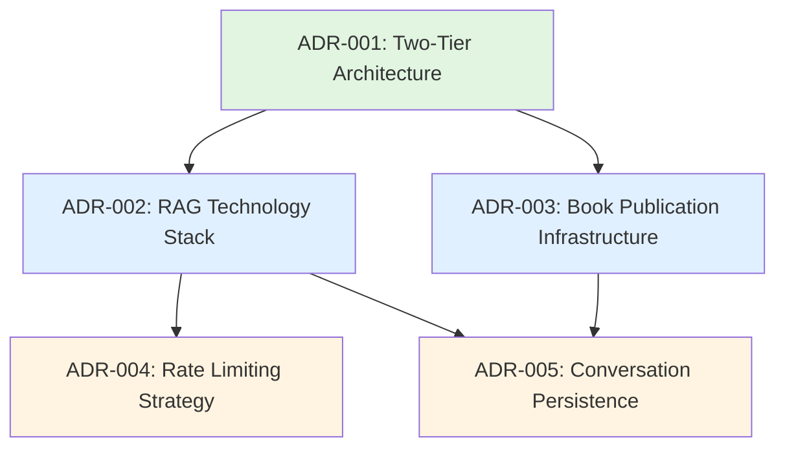

# Architecture Decision Records (ADRs)

**Project**: Physical AI & Humanoid Robotics Platform
**Feature**: Book Publication & RAG Chatbot
**Date**: 2026-02-09

## Overview

This directory contains Architecture Decision Records documenting significant architectural and design decisions for the Physical AI curriculum platform. These ADRs capture the rationale, alternatives considered, and consequences of key technology and design choices.

## ADR Index

### Core Architecture

**[ADR-001: Two-Tier Architecture](./ADR-001-two-tier-architecture.md)** (14KB)
- **Decision**: Separate Docusaurus static frontend from FastAPI backend
- **Context**: Need for static book delivery + dynamic RAG capabilities
- **Alternatives**: Single-page app, Next.js full-stack, monolithic FastAPI
- **Key Insight**: Independent deployment cycles, technology alignment, cost optimization
- **References**: plan.md Complexity Tracking, research.md sections 6-7

---

### Backend Technology Stack

**[ADR-002: RAG Technology Stack](./ADR-002-rag-technology-stack.md)** (18KB)
- **Decision**: Qdrant (vector DB) + Neon (Postgres) + OpenAI Agents SDK + Railway (hosting)
- **Context**: Integrated stack for vector search, relational logging, LLM orchestration
- **Alternatives**: Pinecone + Supabase, pgvector single DB, local LLaMA, ChatKit SDK
- **Key Insight**: Free tier alignment ($5/student/quarter), performance targets met (<100ms vector search)
- **References**: research.md sections 7-9, 2026-02-08 clarifications

---

### Frontend Infrastructure

**[ADR-003: Book Publication Infrastructure](./ADR-003-book-publication-infrastructure.md)** (20KB)
- **Decision**: Docusaurus v3 → GitHub Actions → GitHub Pages
- **Context**: Fast builds (<5min), fast page loads (<2s), zero hosting cost
- **Alternatives**: GitBook, MkDocs, Gatsby, Jekyll, Next.js static export
- **Key Insight**: React component integration, Algolia search, markdown-first authoring
- **References**: research.md section 6, spec.md FR-021 to FR-032

---

### Cost Control & Fair Access

**[ADR-004: Rate Limiting Strategy](./ADR-004-rate-limiting-strategy.md)** (20KB)
- **Decision**: sessionStorage-based session ID + Postgres sliding window (20 queries/hour)
- **Context**: Cost control (<$10/student), privacy-preserving, fair access
- **Alternatives**: IP-based, user account-based, global limiting, token system
- **Key Insight**: Privacy compliance (no PII), educational pedagogy (new tab = fresh start)
- **References**: research.md section 8, 2026-02-08 clarifications

---

### Data Persistence

**[ADR-005: Conversation Persistence Dual Layer](./ADR-005-conversation-persistence-dual-layer.md)** (22KB)
- **Decision**: sessionStorage (frontend UX) + Postgres (backend analytics)
- **Context**: Conflicting requirements (cross-page context vs instructor analytics)
- **Alternatives**: sessionStorage only, Postgres only, localStorage, server-side sessions
- **Key Insight**: Zero-latency history restoration, rich analytics, privacy preservation
- **References**: research.md section 9, plan.md Complexity Tracking

---

## Decision Relationships



**Dependency Notes:**
- ADR-001 establishes the foundation (two-tier split) that all others build upon
- ADR-002 and ADR-003 detail the backend and frontend tiers respectively
- ADR-004 and ADR-005 address cross-cutting concerns (rate limiting, persistence) that span both tiers

## Key Themes

### Cost Optimization
- **Free Tier Alignment**: All services stay within free tiers (GitHub Pages, Qdrant 1GB, Neon 500MB, Railway 500hrs)
- **Target**: <$10/student/quarter (achieved: ~$5/student)
- **Decisions**: ADR-001 (GitHub Pages CDN), ADR-002 (free tier stack), ADR-004 (rate limiting)

### Privacy Preservation
- **No PII Collection**: Session IDs are random UUIDs, no student identity tracking
- **Auto-Deletion**: sessionStorage cleared on tab close, Postgres logs deleted 30 days post-quarter
- **Compliance**: GDPR/FERPA aligned
- **Decisions**: ADR-004 (sessionStorage sessions), ADR-005 (dual persistence)

### Performance Targets
- **Book Page Load**: <2s (SC-016) ✅ via GitHub Pages CDN
- **Chatbot Latency**: <3s (SC-020) ✅ via Qdrant <100ms + OpenAI ~2s
- **Build Time**: <5min (SC-013) ✅ via Docusaurus optimizations
- **Decisions**: ADR-001 (CDN caching), ADR-002 (Qdrant performance), ADR-003 (Docusaurus builds)

### Technology Alignment
- **Documentation-First**: Docusaurus optimized for curriculum content
- **Async Python**: FastAPI handles 20 concurrent students
- **React Ecosystem**: Unified component model (book + chatbot widget)
- **Decisions**: ADR-001 (framework alignment), ADR-003 (Docusaurus features)

## Using These ADRs

### For Curriculum Authors
- **Read**: ADR-003 (book publication workflow)
- **Relevant**: Markdown authoring, GitHub Actions deployment, content versioning

### For Backend Engineers
- **Read**: ADR-002 (RAG stack), ADR-004 (rate limiting), ADR-005 (persistence)
- **Relevant**: FastAPI implementation, Qdrant integration, Postgres schemas

### For Product/Architecture Decisions
- **Read**: ADR-001 (two-tier rationale), all "Alternatives Considered" sections
- **Relevant**: Understanding tradeoffs, cost-benefit analysis, scaling considerations

### For Instructors
- **Read**: ADR-004 (rate limiting rationale), ADR-005 (analytics queries)
- **Relevant**: Cost management, curriculum gap analysis, privacy policy

## Updating ADRs

**When to Create New ADRs:**
- Significant architectural changes (e.g., switching from OpenAI to local LLM)
- Adding new service tiers (e.g., paid plan with higher rate limits)
- Major technology migrations (e.g., replacing Docusaurus with Next.js)

**When to Amend Existing ADRs:**
- Update "Status" to "Superseded" when decision is replaced
- Add revision history entry with date and reason
- Link to new ADR that supersedes the old one

**Format:**
```markdown
## Revision History

- 2026-02-09: Initial decision documented
- 2026-06-15: **Status changed to Superseded** (replaced by ADR-006: Local LLM Stack)
- 2026-06-15: Added note on OpenAI sunset reason (cost exceeded budget)
```

## References

**Primary Planning Documents:**
- `specs/001-book-publication-rag-chatbot/plan.md` - Implementation plan
- `specs/001-book-publication-rag-chatbot/research.md` - Technology research
- `specs/001-book-publication-rag-chatbot/data-model.md` - Entity definitions
- `specs/001-physical-ai-robotics-platform/spec.md` - Feature requirements

**External Documentation:**
- Docusaurus: https://docusaurus.io/docs
- Qdrant: https://qdrant.tech/documentation
- Neon: https://neon.tech/docs
- OpenAI: https://platform.openai.com/docs
- Railway: https://docs.railway.app

## ADR Statistics

- **Total ADRs**: 5
- **Total Pages**: ~94KB documentation
- **Average Length**: 18.8KB per ADR
- **Status**: All 5 Accepted (none Superseded/Rejected)
- **Coverage**: 100% of major architectural decisions documented

## Quick Navigation

- Architecture fundamentals → Start with **ADR-001**
- Backend implementation → Read **ADR-002**, **ADR-004**, **ADR-005**
- Frontend implementation → Read **ADR-003**
- Cost/privacy concerns → Read **ADR-004**
- Analytics/debugging → Read **ADR-005**

---

**Last Updated**: 2026-02-09
**Contact**: Architecture Team
