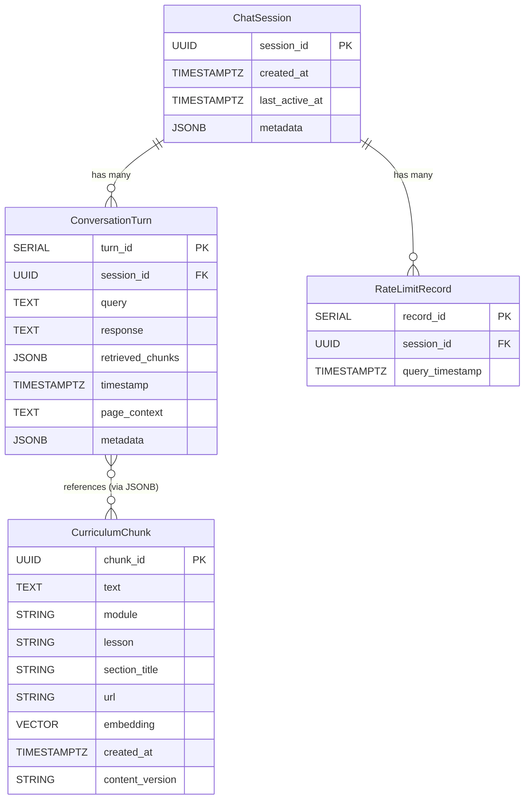
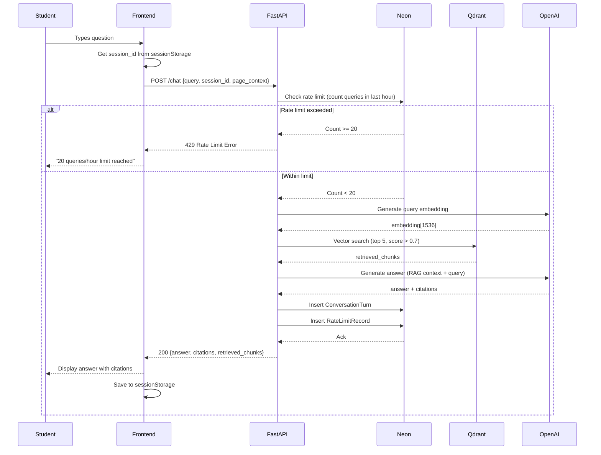
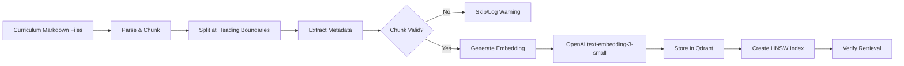
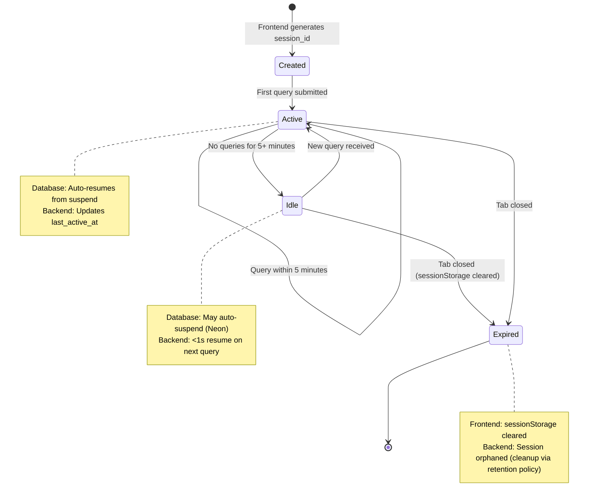

# Data Model: Book Publication & RAG Chatbot

**Feature**: Book Publication & RAG Chatbot
**Branch**: `001-book-publication-rag-chatbot`
**Date**: 2026-02-09
**Phase**: Phase 1 - Design & Contracts

## Overview

This document defines the data entities, relationships, validation rules, and state transitions for the book publication and RAG chatbot system. The data model is divided into two primary domains:

1. **Book Content Domain**: Curriculum chunks stored as vector embeddings in Qdrant
2. **Chatbot Conversation Domain**: Sessions, turns, and rate limiting tracked in Neon Postgres

## Entity Definitions

### 1. CurriculumChunk

**Description**: A semantically coherent text segment from the curriculum book, embedded as a vector for RAG retrieval.

**Storage**: Qdrant Cloud vector database (collection: `curriculum`)

**Fields**:

| Field | Type | Description | Constraints | Example |
|-------|------|-------------|-------------|---------|
| `chunk_id` | UUID | Unique identifier for the chunk | Primary key, auto-generated | `550e8400-e29b-41d4-a716-446655440000` |
| `text` | String | Raw curriculum text content | 50-1000 words, UTF-8 | `"URDF joints define the kinematic relationships..."` |
| `module` | String | Module number | Required, format: `1`, `2`, `3`, `4` | `"1"` |
| `lesson` | String | Lesson identifier within module | Required, format: `lesson-<number>` | `"lesson-3"` |
| `section_title` | String | Heading/section name | Required, max 200 chars | `"Joint Constraints and Workspace"` |
| `url` | String | Absolute URL to source content in book | Required, valid URL format | `"https://yourdomain.github.io/docs/module1/lesson3#joints"` |
| `embedding` | Vector[1536] | OpenAI `text-embedding-3-small` vector | Required, normalized float32 array | `[0.023, -0.15, 0.87, ...]` |
| `created_at` | Timestamp | Chunk creation time | Auto-set on creation | `2026-02-09T10:30:00Z` |
| `content_version` | String | Book version when chunk was created | Semantic versioning | `"1.2.0"` |

**Metadata (Qdrant payload)**:
```json
{
  "chunk_id": "550e8400-e29b-41d4-a716-446655440000",
  "text": "URDF joints define the kinematic relationships...",
  "module": "1",
  "lesson": "lesson-3",
  "section_title": "Joint Constraints and Workspace",
  "url": "https://yourdomain.github.io/docs/module1/lesson3#joints",
  "created_at": "2026-02-09T10:30:00Z",
  "content_version": "1.2.0"
}
```

**Relationships**:
- Referenced by `ConversationTurn.retrieved_chunks` (many-to-many)

**Validation Rules**:
- Text length: 50-1000 words (split longer sections at heading boundaries)
- Module must be one of: `"1"`, `"2"`, `"3"`, `"4"`
- URL must match pattern: `https://<domain>/docs/module<N>/<lesson>#<anchor>`
- Embedding dimension must be exactly 1536 (OpenAI `text-embedding-3-small`)
- Cosine similarity threshold for retrieval: >0.7 (FR-039)

**Indexes**:
- Qdrant HNSW index on `embedding` vector (default, optimized for cosine similarity)

**Chunking Strategy**:
- Split at Markdown heading boundaries (`##` and `###`)
- Preserve semantic coherence (don't split mid-code block or mid-list)
- Include heading text in chunk for context
- Max 1000 words to stay within embedding context window

---

### 2. ChatSession

**Description**: A browser session representing a single student's interaction context with the chatbot. Used for rate limiting and conversation grouping.

**Storage**: Neon Serverless Postgres (table: `chat_sessions`)

**Schema**:
```sql
CREATE TABLE chat_sessions (
    session_id UUID PRIMARY KEY DEFAULT gen_random_uuid(),
    created_at TIMESTAMPTZ NOT NULL DEFAULT NOW(),
    last_active_at TIMESTAMPTZ NOT NULL DEFAULT NOW(),
    metadata JSONB DEFAULT '{}'::jsonb
);

CREATE INDEX idx_sessions_last_active ON chat_sessions(last_active_at DESC);
```

**Fields**:

| Field | Type | Description | Constraints | Example |
|-------|------|-------------|-------------|---------|
| `session_id` | UUID | Unique session identifier | Primary key, generated client-side via `crypto.randomUUID()` | `"a1b2c3d4-e5f6-7890-abcd-ef1234567890"` |
| `created_at` | TIMESTAMPTZ | Session creation time | Auto-set on first query | `2026-02-09T14:00:00Z` |
| `last_active_at` | TIMESTAMPTZ | Last query timestamp | Updated on each query | `2026-02-09T14:45:00Z` |
| `metadata` | JSONB | Optional session metadata | User-agent, browser info | `{"user_agent": "Mozilla/5.0..."}` |

**Relationships**:
- Has many `ConversationTurn` records (one-to-many)
- Has many `RateLimitRecord` entries (one-to-many)

**Validation Rules**:
- `session_id` must be valid UUIDv4
- `last_active_at` must be >= `created_at`
- Auto-update `last_active_at` on every query

**State Transitions**:
```
created → active → idle → expired (sessionStorage cleared)
```

- **created**: Session ID generated on first chatbot widget load
- **active**: `last_active_at` updated within last 5 minutes
- **idle**: No queries for >5 minutes, database may auto-suspend (Neon behavior)
- **expired**: Browser tab closed, sessionStorage cleared (session ID lost)

---

### 3. ConversationTurn

**Description**: A single question-answer exchange between a student and the RAG chatbot, logged for analytics and debugging.

**Storage**: Neon Serverless Postgres (table: `conversation_turns`)

**Schema**:
```sql
CREATE TABLE conversation_turns (
    turn_id SERIAL PRIMARY KEY,
    session_id UUID NOT NULL REFERENCES chat_sessions(session_id) ON DELETE CASCADE,
    query TEXT NOT NULL CHECK (char_length(query) BETWEEN 1 AND 500),
    response TEXT NOT NULL,
    retrieved_chunks JSONB NOT NULL DEFAULT '[]'::jsonb,
    timestamp TIMESTAMPTZ NOT NULL DEFAULT NOW(),
    page_context TEXT,
    metadata JSONB DEFAULT '{}'::jsonb
);

CREATE INDEX idx_turns_session_time ON conversation_turns(session_id, timestamp DESC);
CREATE INDEX idx_turns_timestamp ON conversation_turns(timestamp DESC);
```

**Fields**:

| Field | Type | Description | Constraints | Example |
|-------|------|-------------|-------------|---------|
| `turn_id` | SERIAL | Auto-incrementing turn ID | Primary key | `42` |
| `session_id` | UUID | Foreign key to `chat_sessions` | Required, must exist in sessions table | `"a1b2c3d4-e5f6-7890-abcd-ef1234567890"` |
| `query` | TEXT | Student's question | 1-500 chars, sanitized input | `"What are URDF joint limits?"` |
| `response` | TEXT | Chatbot's answer | Max 2000 chars (truncated if needed) | `"According to Module 1, Lesson 3, URDF joint limits..."` |
| `retrieved_chunks` | JSONB | Top-5 chunks with scores | Array of objects: `[{chunk_id, text_preview, score}]` | `[{"chunk_id": "550e...", "text_preview": "URDF joints define...", "score": 0.89}]` |
| `timestamp` | TIMESTAMPTZ | Query submission time | Auto-set on insert | `2026-02-09T14:30:45Z` |
| `page_context` | TEXT | Current book page URL when query submitted | Optional, max 500 chars | `"https://yourdomain.github.io/docs/module1/lesson3"` |
| `metadata` | JSONB | Additional context | User-agent, selection text if any | `{"user_agent": "Mozilla/5.0...", "selection_text": "joint limits"}` |

**Relationships**:
- Belongs to `ChatSession` (many-to-one)
- References `CurriculumChunk` via `retrieved_chunks` JSONB array (many-to-many)

**Validation Rules**:
- `query` length: 1-500 characters (enforced by CHECK constraint)
- `retrieved_chunks` array: max 5 elements
- Each chunk in `retrieved_chunks` must have `chunk_id`, `text_preview` (max 200 chars), `score` (float 0.0-1.0)
- `page_context` must be valid URL if provided
- Sanitize `query` before storage: strip special tokens (`<|endoftext|>`, `<|im_sep|>`), remove markdown injection attempts

**Retrieved Chunks Format**:
```json
[
  {
    "chunk_id": "550e8400-e29b-41d4-a716-446655440000",
    "text_preview": "URDF joints define the kinematic relationships between rigid bodies...",
    "score": 0.89,
    "module": "1",
    "lesson": "lesson-3",
    "section_title": "Joint Constraints",
    "url": "https://yourdomain.github.io/docs/module1/lesson3#joints"
  }
]
```

**Retention Policy** (FR-019, FR-047):
- Retain all conversation turns until **30 days after quarter end date**
- Auto-delete via scheduled cleanup job (daily cron):
```sql
DELETE FROM conversation_turns
WHERE timestamp < NOW() - INTERVAL '90 days';  -- Adjust based on quarter schedule
```

---

### 4. RateLimitRecord

**Description**: Tracks query timestamps for sliding-window rate limiting (20 queries/hour per session).

**Storage**: Neon Serverless Postgres (table: `rate_limit_records`)

**Schema**:
```sql
CREATE TABLE rate_limit_records (
    record_id SERIAL PRIMARY KEY,
    session_id UUID NOT NULL REFERENCES chat_sessions(session_id) ON DELETE CASCADE,
    query_timestamp TIMESTAMPTZ NOT NULL DEFAULT NOW()
);

CREATE INDEX idx_rate_limit_session_time ON rate_limit_records(session_id, query_timestamp DESC);
```

**Fields**:

| Field | Type | Description | Constraints | Example |
|-------|------|-------------|-------------|---------|
| `record_id` | SERIAL | Auto-incrementing record ID | Primary key | `123` |
| `session_id` | UUID | Foreign key to `chat_sessions` | Required | `"a1b2c3d4-e5f6-7890-abcd-ef1234567890"` |
| `query_timestamp` | TIMESTAMPTZ | When query was submitted | Auto-set on insert | `2026-02-09T14:30:45Z` |

**Relationships**:
- Belongs to `ChatSession` (many-to-one)

**Validation Rules**:
- `query_timestamp` must be <= NOW() (no future timestamps)
- Records older than 1 hour are ignored for rate limit checks (sliding window)

**Rate Limit Logic** (FR-048):
```python
async def check_rate_limit(session_id: UUID) -> bool:
    """Check if session has exceeded 20 queries in last hour."""
    query = """
        SELECT COUNT(*) as query_count
        FROM rate_limit_records
        WHERE session_id = $1
        AND query_timestamp > NOW() - INTERVAL '1 hour'
    """
    result = await db.fetch_one(query, session_id)
    return result["query_count"] < 20  # Allow up to 20 queries/hour
```

**Cleanup Policy**:
- Auto-delete records older than 1 hour (no longer needed for rate limit checks):
```sql
DELETE FROM rate_limit_records
WHERE query_timestamp < NOW() - INTERVAL '1 hour';
```
- Run cleanup hourly via scheduled job to prevent table bloat

---

## Entity Relationship Diagram



## Data Flow Diagrams

### Chatbot Query Flow



### Curriculum Embedding Pipeline



## Validation Rules Summary

### Input Validation

| Entity | Field | Validation Rule | Error Message |
|--------|-------|-----------------|---------------|
| ChatQuery | `query` | 1-500 chars, no special tokens | "Query must be 1-500 characters" |
| ChatQuery | `session_id` | Valid UUIDv4 | "Invalid session ID format" |
| CurriculumChunk | `text` | 50-1000 words | "Chunk text out of range (50-1000 words)" |
| CurriculumChunk | `module` | Must be `"1"`, `"2"`, `"3"`, or `"4"` | "Invalid module number" |
| CurriculumChunk | `embedding` | Exactly 1536 dimensions | "Embedding dimension mismatch" |
| ConversationTurn | `retrieved_chunks` | Array of max 5 objects | "Too many retrieved chunks" |
| RateLimitRecord | `query_timestamp` | <= NOW() | "Future timestamp not allowed" |

### Business Logic Validation

| Rule | Description | Related Requirements |
|------|-------------|---------------------|
| **Minimum Similarity Threshold** | Retrieved chunks must have cosine similarity > 0.7 | FR-039 |
| **Context Window Management** | Combined retrieved text + query < 8000 tokens | FR-040 |
| **Rate Limit Enforcement** | Max 20 queries per session per hour (sliding window) | FR-048 |
| **Session Storage Limit** | Max 500 message pairs in frontend sessionStorage | FR-055 |
| **Log Retention Policy** | Auto-delete conversation turns > 30 days after quarter end | FR-019, FR-047 |

## State Transitions

### ChatSession Lifecycle



### Neon Postgres Auto-Suspend

```mermaid
stateDiagram-v2
    [*] --> Running: Query received
    Running --> Running: Active queries
    Running --> Suspended: Idle for 5 minutes
    Suspended --> Running: New query (<1s resume)
    Running --> [*]

    note right of Suspended
        Free tier: 1 compute hour/month
        Storage persists during suspend
        No queries processed while suspended
    end note
```



## Database Initialization Script

**File**: `backend/scripts/setup_db.py`

```python
"""
Initialize Neon Postgres schema for RAG chatbot.
Run once during deployment setup.
"""
import asyncio
import asyncpg
import os

async def setup_database():
    # Connect to Neon Postgres
    conn = await asyncpg.connect(os.getenv("NEON_DATABASE_URL"))

    try:
        # Create chat_sessions table
        await conn.execute("""
            CREATE TABLE IF NOT EXISTS chat_sessions (
                session_id UUID PRIMARY KEY DEFAULT gen_random_uuid(),
                created_at TIMESTAMPTZ NOT NULL DEFAULT NOW(),
                last_active_at TIMESTAMPTZ NOT NULL DEFAULT NOW(),
                metadata JSONB DEFAULT '{}'::jsonb
            )
        """)

        # Create conversation_turns table
        await conn.execute("""
            CREATE TABLE IF NOT EXISTS conversation_turns (
                turn_id SERIAL PRIMARY KEY,
                session_id UUID NOT NULL REFERENCES chat_sessions(session_id) ON DELETE CASCADE,
                query TEXT NOT NULL CHECK (char_length(query) BETWEEN 1 AND 500),
                response TEXT NOT NULL,
                retrieved_chunks JSONB NOT NULL DEFAULT '[]'::jsonb,
                timestamp TIMESTAMPTZ NOT NULL DEFAULT NOW(),
                page_context TEXT,
                metadata JSONB DEFAULT '{}'::jsonb
            )
        """)

        # Create rate_limit_records table
        await conn.execute("""
            CREATE TABLE IF NOT EXISTS rate_limit_records (
                record_id SERIAL PRIMARY KEY,
                session_id UUID NOT NULL REFERENCES chat_sessions(session_id) ON DELETE CASCADE,
                query_timestamp TIMESTAMPTZ NOT NULL DEFAULT NOW()
            )
        """)

        # Create indexes
        await conn.execute("CREATE INDEX IF NOT EXISTS idx_sessions_last_active ON chat_sessions(last_active_at DESC)")
        await conn.execute("CREATE INDEX IF NOT EXISTS idx_turns_session_time ON conversation_turns(session_id, timestamp DESC)")
        await conn.execute("CREATE INDEX IF NOT EXISTS idx_turns_timestamp ON conversation_turns(timestamp DESC)")
        await conn.execute("CREATE INDEX IF NOT EXISTS idx_rate_limit_session_time ON rate_limit_records(session_id, query_timestamp DESC)")

        print("✅ Database schema initialized successfully")

    finally:
        await conn.close()

if __name__ == "__main__":
    asyncio.run(setup_database())
```

## Capacity Planning

### Qdrant Cloud (1GB Free Tier)

**Current Estimate**:
- Chunks: 500-800 (assuming 4 modules, 20-32 lessons)
- Embedding dimensions: 1536 (OpenAI `text-embedding-3-small`)
- Storage per chunk: ~6KB (1536 dimensions × 4 bytes float32 + metadata)
- Total storage: 500 chunks × 6KB = ~3MB vectors + ~600KB metadata = **~3.6MB** (well within 1GB limit)

**Growth Headroom**: Can store ~170,000 chunks before hitting 1GB limit

### Neon Postgres (500MB Storage, 1 Compute Hour/Month)

**Storage Estimate**:
- 1000 conversation turns × 2KB/turn = 2MB
- 20,000 rate limit records × 100 bytes/record = 2MB
- Total: **~4MB** (well within 500MB limit)

**Compute Hour Management**:
- 20 students × 10 queries/week × 12 weeks = 2400 queries/quarter
- Avg query time: 200ms processing + 50ms logging = 250ms
- Total compute: 2400 × 0.25s = 600s = **0.17 hours** (17% of 1 hour limit)
- Auto-suspend after 5 min idle keeps compute usage minimal

## Testing Checklist

### Data Model Validation Tests

- [ ] Create ChatSession with valid UUIDv4, verify creation timestamp
- [ ] Insert ConversationTurn with 500-char query, verify no truncation
- [ ] Insert ConversationTurn with 501-char query, verify CHECK constraint rejection
- [ ] Retrieve top-5 chunks from Qdrant with score threshold 0.7
- [ ] Insert RateLimitRecord and verify sliding window count (1 hour)
- [ ] Delete ChatSession and verify cascade delete of turns and rate limit records
- [ ] Test sessionStorage persistence across page navigation
- [ ] Verify auto-delete of conversation turns older than retention period
- [ ] Test Neon auto-suspend after 5 min idle, verify <1s resume on query
- [ ] Verify retrieved_chunks JSONB format matches expected schema

### Capacity Tests

- [ ] Insert 1000 conversation turns, verify query performance <50ms
- [ ] Store 800 chunks in Qdrant, verify search latency <100ms
- [ ] Simulate 20 concurrent sessions, verify no database connection exhaustion
- [ ] Test rate limit enforcement at 20 queries/hour boundary
- [ ] Verify sessionStorage cleanup after 500 message pairs

## References

- **Plan.md**: Phase 1.1 Data Model specifications
- **Research.md**: Section 9 (Conversation History & Persistence), Section 8 (Rate Limiting Strategy)
- **Spec.md**: FR-035 (Qdrant), FR-037 (Neon), FR-039 (Retrieval threshold), FR-047 (Logging), FR-048 (Rate limiting), FR-055 (sessionStorage)
